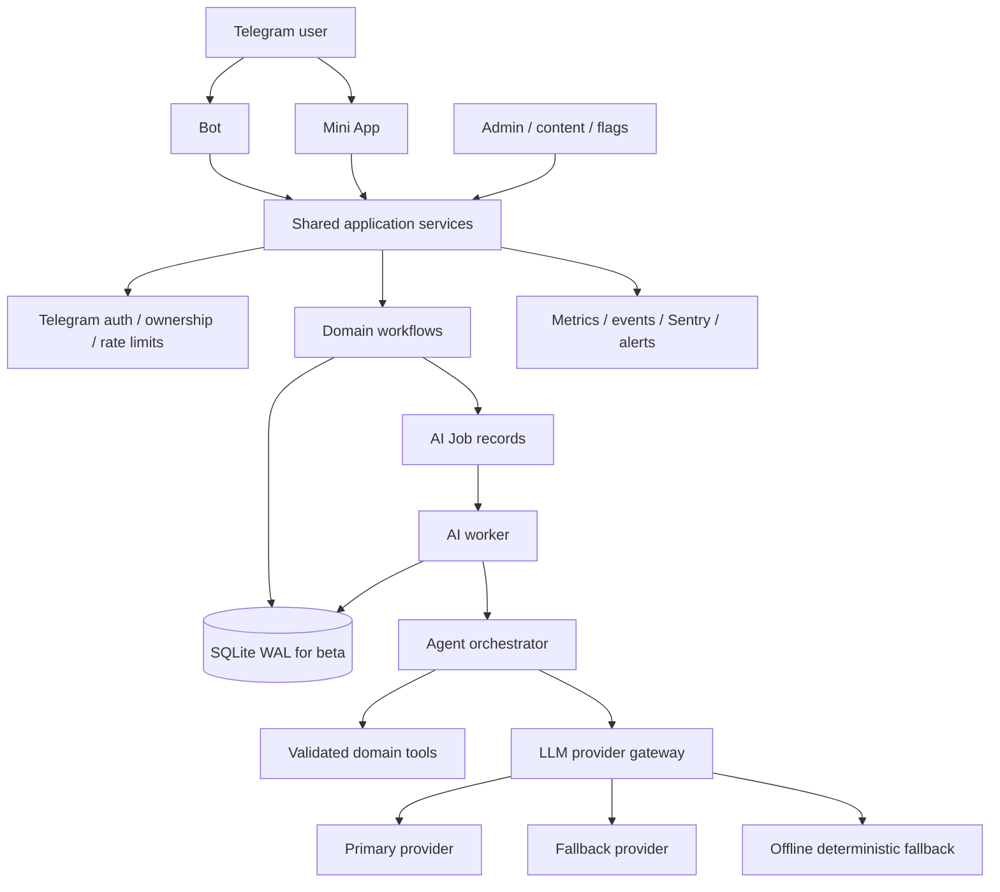

# OracleAI — архитектурный аудит и план доведения до законченного продукта

**Репозиторий:** [`astartv1ai-del/oracleAI`](https://github.com/astartv1ai-del/oracleAI)
**Проверенный commit:** `284acc0785ecf80f6b09d24ea276116d9c51e915`
**Ветка:** `master`
**Дата аудита:** 14 августа 2026 года
**Режим:** read-only аудит; продуктовый код не изменялся.

---

## 1. Итоговое заключение

OracleAI уже значительно дальше обычного прототипа. В репозитории присутствует полноценный Telegram-бот и Mini App, четыре проводника, расчётные домены, Таро, дневник, opt-in память, пальм-vision pipeline, платежи, админ-панель, feature flags, аналитика, резервное копирование, CI и большой набор автоматических проверок. Это не «пустой каркас», а функционально насыщенный **modular monolith**, который можно довести до controlled beta без смены технологического стека.

Однако текущий статус нельзя честно называть готовностью к публичному запуску. Правильная формулировка выглядит так:

> **Кодовая и CI-готовность достигнуты; production и public-launch готовность ещё не доказаны.**

Главные риски находятся не в синтаксисе или базовой функциональности. Они сосредоточены в пяти местах: отсутствие доказанного live provider quality, синхронная обработка palm vision без устойчивого job/status-контракта, неполный self-service privacy flow, отсутствие реального device/payment/staging rehearsal и недостаточно строгий LLM governance-контур.

### Сводная оценка

| Область | Текущее состояние | Оценка | Что это означает |
|---|---|---:|---|
| Базовая функциональность | Большинство доменных сценариев и API реализованы | Высокое | Можно переходить от «строить всё» к стабилизации главного пользовательского цикла |
| Кодовая дисциплина | 381 тест собран, pytest проходит, Ruff проходит, dependency audit проходит | Высокое | Регрессионная база хорошая, но она не заменяет live и real-device проверки |
| UX/UI | Продуманная визуальная система, age-gate, onboarding, chat guide, recovery states | Средне-высокое | Нужен manual Telegram QA и усиление bootstrap/error states |
| Агентная архитектура | Явные AgentSpec, skill allow-list, safety и evidence-first подход | Средне-высокое | Логика зрелая, но tool validation и доменная декомпозиция недостаточны |
| LLM-платформа | Provider chain, retry, fallback, usage logging | Среднее | Нужны versioning, circuit breaker, строгие бюджеты, реальные provider benchmarks |
| Palm vision | Валидация, structured schema, sanitize, raw image не хранится | Среднее | Главный технический P0: запрос синхронный, нет job queue/status и доказанного p95 |
| Безопасность | Много server-side guards и хорошая документация | Средне-высокое | Не закрыты external legal review, deletion/export, secrets/access drill и incident rehearsal |
| Инфраструктура | Docker Compose, Caddy, backup service, healthcheck | Среднее | Годится для ограниченной beta; staging/deploy/restore/load proof отсутствуют |
| Монетизация | Схема планов, Stars/Paddle, idempotency и unit-economics модели | Среднее | Нужны sandbox certification, reconciliation, refunds и observed economics |
| Public launch | Не подтверждён | Низкое | Сначала controlled beta и прохождение P0/P1 gates |

---

## 2. Что уже сделано хорошо и что нельзя сломать

Сильнейшее решение проекта — единая доменная логика для Telegram-бота и Mini App. Общий сервисный слой уменьшает риск, что один канал списывает лимит, сохраняет историю или обрабатывает safety-сценарий иначе, чем другой. Основной flow вопроса действительно построен в правильном порядке: проверка безопасности, проверка и списание доступа, сохранение вопроса, генерация ответа, возврат списания при сбое, сохранение ответа и аналитика. Это подтверждается [`app/services/chat.py`](https://github.com/astartv1ai-del/oracleAI/blob/master/app/services/chat.py) и архитектурной документацией [2] [3].

Второе сильное решение — deterministic safety до LLM. Кризисный сценарий не отдаётся на усмотрение модели, не списывает лимит и формирует ответ кодом. Memory-off также защищён серверно в профиле, chat service, runtime и tools. Такой подход необходимо сохранить и распространить на все новые функции.

Третье сильное решение — разделение фактов и интерпретации. Астрологические данные, карты Таро и palm evidence рассчитываются или извлекаются детерминированным слоем, а модель получает закрытый evidence block. Это существенно лучше, чем свободная генерация «по памяти» и соответствует заявленному product promise: символические практики должны помогать рефлексии, а не выдавать себя за объективный прогноз [4] [5].

Четвёртая сильная сторона — product ethics. В документации явно зафиксированы 16+, opt-in memory, запрет медицинских/юридических/финансовых гарантий, недопустимость давления через страх и требование пользовательского выбора. Для стартапа это не декоративная часть бренда, а дифференциатор и основа доверия. Его нельзя жертвовать ради конверсии, streak или платёжного давления.

---

## 3. Фактический baseline аудита

После установки зафиксированных зависимостей проекта и dev-зависимостей проверки дали следующий результат.

| Проверка | Результат |
|---|---|
| Python test suite | **381 тест собран и проходит** |
| Ruff | **PASS** |
| Python syntax/import smoke | **PASS** |
| JavaScript syntax | **PASS** |
| Design contract | **PASS** |
| Static release gate | **PASS** |
| `pip-audit -r requirements.txt` | **PASS; known vulnerabilities не обнаружены** |
| Selfcheck | **PASS**, при этом live LLM и production env корректно пропущены |
| Git diff hygiene | **PASS** |
| Live LLM в audit environment | Не является подтверждённым: OpenAI-compatible proxy возвращал HTTP 200 с пустым content, после retry выполнялся offline fallback |
| Embeddings | В audit environment endpoint вернул 404; память перешла на keyword fallback |
| Docker build/compose | Не подтверждены в sandbox, поскольку Docker недоступен |
| Telegram real-device QA | Не подтверждён |
| Paddle/Stars production certification | Не подтверждён |
| External legal review | Не подтверждён |

Зелёные проверки означают, что воспроизводимые кодовые контракты работают. Они не доказывают, что выбранный live provider возвращает качественный ответ, что Mini App одинаково работает на iOS/Android/Desktop, что платёжный webhook прошёл сертификацию или что production backup реально восстановим. Это различие уже корректно сформулировано в собственном evidence-документе проекта [6].

---

## 4. Главная продуктовая стратегия

### 4.1. Кому и какую ценность продаёт продукт

Наиболее ясная первичная аудитория — русско- и англоязычные пользователи Telegram 16+, которым нужен короткий безопасный инструмент саморефлексии в момент неопределённости. Продукт не должен позиционироваться как «точный эзотерический прогноз», терапия или экспертная консультация. Его рабочее обещание уже сформулировано удачно: **«Вопросы к миру. Бережные ответы — к себе.»** [1].

Основной job-to-be-done должен звучать так: «Когда я не понимаю, что чувствую или какой следующий шаг выбрать, я хочу быстро получить ясную рамку для размышления и один реалистичный вариант действия — без давления и категоричных обещаний».

### 4.2. Единственный главный end-to-end сценарий

До добавления новых агентов и калькуляторов необходимо довести до идеала один цикл:

| Шаг | Что должно происходить |
|---|---|
| Вход | Пользователь понимает возрастную границу, ценность и приватность |
| Первый результат | За 60–120 секунд получает карту дня, микро-ритуал или первый безопасный вопрос |
| Выбор проводника | Понимает разницу между Лилит, Уранией, Мадам Ленорман и Мирой |
| Запрос | Пишет вопрос или выбирает безопасный шаблон |
| Работа AI | Видит состояние, статус и понятный fallback; не сталкивается с бесконечным spinner |
| Ответ | Получает факт/символ, интерпретацию, ограничение и один следующий шаг |
| Контроль | Может сохранить, отредактировать, удалить или не продолжать |
| Возврат | Видит историю и может вернуться добровольно, без стыда за пропуск |

**Первый результат должен быть не обязательно LLM-ответом.** Если provider недоступен, детерминированный ritual fallback всё равно должен быть полноценным и честно обозначенным как шаблонная рефлексивная интерпретация.

### 4.3. Метрики, которые нужно утвердить

До beta следует выбрать реальные числовые пороги. Без этого невозможно определить, хороший ли продукт.

| Метрика | Определение | Решение, которое она поддерживает |
|---|---|---|
| Activation | `age_confirmed` + первый завершённый ritual/question | Понимает ли пользователь ценность |
| Time to first value | Время от открытия до первого результата | Где появляется трение |
| Completion rate | Доля начатых сценариев, дошедших до результата | Стабильность UX и AI |
| Retry rate | Доля повторных отправок после ошибки | Качество provider/API/UX |
| Manual correction rate | Доля ответов, которые пользователь редактирует/отмечает как неполезные | Качество интерпретации |
| Voluntary D1/D7 return | Возврат без push-pressure | Реальная привычка, а не зависимость от уведомлений |
| Cost per successful outcome | `LLM + vision + infra` на завершённый результат | Управление юнит-экономикой |
| Safety escalation rate | Кризисные/softened случаи и их resolution | Безопасность и support capacity |
| Deletion/support SLA | Время обработки privacy/support requests | Доверие и compliance |

---

## 5. Приоритетные блокеры

### P0 — закрыть до любого внешнего трафика

| ID | Область | Проблема | Что сделать | Сложность | Критерий приёмки |
|---|---|---|---|---:|---|
| P0-01 | Product/Governance | Нет утверждённого launch brief с первой страной, аудиторией, DAU/MAU, budget, support hours и owner-ами | Зафиксировать controlled beta brief и release owner matrix | S | Есть подписанный документ: scope, страны, языки, limits, owners, no-go rules |
| P0-02 | LLM/Vision | Live provider quality и latency не доказаны; audit proxy возвращал пустой content | Провести staging benchmark для каждого выбранного provider/model; включить structured success, fallback и p95 | M | Approved synthetic set; 0 critical safety failures; schema success ≥99%; утверждённый p95 |
| P0-03 | Palm/Architecture | `POST /api/palm` синхронно ждёт vision call; нет job/status endpoint и worker | Ввести `palm_jobs` или обобщённую `ai_jobs`: create → processing → complete/needs_photo/failed, poll/status, retry, cancellation, TTL | L | API быстро возвращает job ID; UI переживает reload; retry идемпотентен; timeout не блокирует request |
| P0-04 | Agent/Security | Tools имеют JSON Schema для модели, но server-side handler не валидирует args отдельной схемой | Добавить Pydantic contract per tool, reject unknown fields/enums/oversized strings и проверять allow-list до execution | M | Negative tests на каждый tool; invalid args не вызывают side effect |
| P0-05 | LLM Governance | Нет полноценного prompt/model/schema versioning и post-generation contract | Ввести prompt registry с `prompt_id`, `version`, `model`, `schema_version`, route metadata и deterministic validators | M | Каждый ответ/ошибка в usage/audit связан с версиями; rollback prompt/model возможен без кода |
| P0-06 | LLM Cost | `PRICING` hardcoded и неизвестные модели оцениваются как `$0`; embeddings обходят usage ledger и общий rate limiter | Ввести provider price config/runtime catalog, unknown-cost alert, единый metering для chat/vision/embeddings/TTS | M | Ни один вызов с неизвестной ценой не считается бесплатным; dashboard показывает cost per successful outcome |
| P0-07 | Privacy | Пользовательского export/self-service deletion flow не подтверждено; anonymize доступен только owner через admin | Добавить `/api/privacy/export`, `/api/privacy/delete-request`, status, confirmation и SLA; bot/Mini App UI | L | Пользователь может инициировать flow, видит status, связанные данные удаляются согласно policy, audit не раскрывает личный текст |
| P0-08 | Legal/Trust | External legal review, country scope, cross-border provider processing и retention policy не закрыты | Провести review Privacy/Terms/16+ / deletion / payment / provider subprocessors | M | Есть письменное заключение по первой волне стран и approved data map |
| P0-09 | Operations | Staging, production secrets, HTTPS, off-site encrypted backup и restore drill не подтверждены | Поднять изолированный staging; провести deploy/release/backup/restore/rollback rehearsal | M | Rehearsal evidence: logs, checksum, restore result, rollback result, health dashboard |
| P0-10 | UX/Device | Нет реальной матрицы Telegram iOS/Android/Desktop | Прогнать first launch, age gate, chat, palm upload, slow network, offline, checkout return и deletion | L | Critical flows проходят на всех целевых устройствах; screenshots/video/evidence сохранены |
| P0-11 | Safety | Deterministic safety есть, но нужен red-team на live provider и cross-agent leakage | Добавить jailbreak, prompt injection, crisis, medical/legal/financial, coercion, age and tool isolation cases | M | Критических safety failures — 0; Мира не получает чужие tools ни в одном provider mode |
| P0-12 | Release ownership | CI зелёный, но deployment workflow, CODEOWNERS, security disclosure и named on-call не подтверждены | Добавить ownership matrix, release checklist, staging promotion и incident contacts | S/M | Для каждого P0 есть владелец, runbook, alert owner и rollback action |

### P1 — закрыть до public launch

| ID | Область | Проблема | Что сделать | Сложность | Критерий приёмки |
|---|---|---|---|---:|---|
| P1-01 | UX | `/api/me`, agents и today при ошибке тихо переходят в пустое состояние | Сделать единый bootstrap state: loading/success/unauthorized/offline/retry | M | Пользователь всегда понимает, что произошло и что можно сделать |
| P1-02 | UX | Ошибки чата не различают 401/403/409/429/5xx; draft может потеряться при reload | Ввести typed API errors, persistent draft per thread, retry semantics и idempotency key | M | Нельзя случайно повторно списать действие; draft восстанавливается |
| P1-03 | Architecture | `skills.py` около 72.7 KB смешивает все доменные tools | Разнести registry по `skills/tarot`, `skills/astro`, `skills/palm`, `skills/memory`, `skills/practices`; общий protocol оставить тонким | L | Новая фича не требует редактировать giant module; contract tests доменные |
| P1-04 | LLM | Нет circuit breaker и provider health state; retry может ждать недоступный provider | Добавить per-provider failure window, cooldown, half-open probe и fallback metrics | M | После N failures provider временно исключается; latency и error budget снижаются |
| P1-05 | LLM | `max_tokens` ограничен на итерацию, но не обязательно на логическую задачу | Ввести task-level token/time budget и отдельные ceilings для planning/tool/final | M | Один user action имеет предсказуемый hard budget |
| P1-06 | LLM | Свободный текст agent answer не имеет общей schema/quality gate | Ввести внутренний response contract: `answer`, `facts`, `limitations`, `next_step`, `safety_state`; рендерить пользовательский текст отдельно | L | UI не зависит от parsing prose; отсутствующие facts/limitations ловятся кодом |
| P1-07 | Analytics | Events и llm_usage есть, но необходимо доказать deletion/retention и no-text invariant end-to-end | Добавить property-based/negative tests и scheduled cleanup audit | M | Ни одно запрещённое поле не попадает в event; deletion policy проверяется автоматикой |
| P1-08 | Payments | Idempotency и webhook code есть, но sandbox certification не завершена | Сертифицировать pending order, duplicate delivery, failed, refund, cancellation, entitlement reconciliation | M | Полный сценарий проходит в sandbox и сверяется с order/payment ledger |
| P1-09 | Infrastructure | SQLite/one worker не имеет capacity proof | Провести load test с read/write/LLM mix, DB lock rate, p95/p99 и burst limits | M | Зафиксирован beta ceiling и trigger для PostgreSQL/Redis/queue migration |
| P1-10 | Accessibility | Static design contract не равен device/screen-reader audit | Проверить contrast, focus, labels, keyboard, touch targets, reduced motion, safe areas и RU/EN overflow | M | Critical user flows доступны на целевых устройствах |
| P1-11 | Support | Есть admin message и CRM, но нет полноценного self-service help/support SLA | Добавить in-app support, FAQ by scenario, privacy/payment/safety templates, escalation path | M | Support request получает status, owner и SLA |
| P1-12 | Growth | Много monetization assumptions, но нет observed cohort evidence | Запустить invite beta waves, funnel dashboard и weekly cohort review | M | Две последовательные beta waves проходят error/cost/support/retention gates |

### P2 — после доказанной beta value

| ID | Область | Что делать |
|---|---|---|
| P2-01 | Data plane | PostgreSQL + PITR, если load ceiling/lock rate требуют миграции |
| P2-02 | Queue | Redis/distributed rate limits и worker queue для длительных AI jobs |
| P2-03 | Product | Advanced personalization, richer memory controls, user-controlled summaries |
| P2-04 | Growth | Referral expansion, lifecycle messaging и creator/community acquisition |
| P2-05 | AI | Reranker/RAG, stronger evaluator, multi-model adjudication только при измеримой пользе |
| P2-06 | Content | Редакционный календарь RU/EN, seasonal rituals и systematic content QA |

### P3 — пока не трогать

Не следует сейчас добавлять новых проводников, десятки новых калькуляторов, voice/TTS, сложные social features или микросервисную архитектуру. Эти функции увеличат поверхность ошибок и стоимость, но не закрывают текущие P0: live reliability, palm job-state, privacy, device QA и operations.

---

## 6. Целевая архитектура

### 6.1. Рекомендуемый вариант

Для ближайшего controlled beta оптимален **модульный монолит с отдельным AI job worker внутри того же deployment-контура**. Не требуется немедленный переход к микросервисам или PostgreSQL. Нужно сохранить единый доменный код, но отделить короткие HTTP-запросы от долгих AI/vision задач.



### 6.2. Почему не микросервисы сейчас

| Подход | Плюсы | Минусы | Решение |
|---|---|---|---|
| Модульный монолит без worker | Минимальная сложность | Длинные jobs блокируют request; слабый retry/reload UX | Уже недостаточен для Palm |
| Модульный монолит + AI worker | Сохраняет скорость разработки и общую БД; даёт устойчивый job-state | Появляется очередь/worker и дополнительная наблюдаемость | **Рекомендуется для beta** |
| Микросервисы | Изоляция и отдельное масштабирование | Дороже deploy, tracing, transactions и support | Только после измеренного scale trigger |

### 6.3. Состояние AI job

Рекомендуемая state machine:

`created → queued → processing → awaiting_provider → validating → complete`

Дополнительные terminal/recovery states: `needs_input`, `needs_photo`, `failed_retryable`, `failed_final`, `cancelled`, `expired`.

Каждый job должен иметь `job_id`, `user_id`, `kind`, `idempotency_key`, `status`, `attempt`, `provider`, `model`, `prompt_version`, `schema_version`, `created_at`, `updated_at`, `expires_at`, `error_code` и sanitized result reference. Сырые изображения не должны сохраняться; анализ должен сохранять только разрешённые metadata и structured result.

---

## 7. Агентная архитектура и логика

### 7.1. Что есть сейчас

В проекте четыре агента с узкими наборами skills: Лилит, Урания, Мадам Ленорман и Мира. Такой allow-list — правильнее, чем дать каждому агенту полный доступ к системе. Особенно хорошо, что Мира не получает Tarot/Astro/Matrix tools, а в её правилах явно запрещены медицинские, фаталистические, возрастные, финансовые и relational claims [7] [8].

### 7.2. Как должен выглядеть контракт каждого агента

Каждый AgentSpec следует дополнить следующими полями:

| Поле | Назначение |
|---|---|
| `goal` | Одна доменная задача агента |
| `allowed_tools` | Immutable allow-list |
| `forbidden_topics` | Детерминированные категории ограничения |
| `input_schema` | Тип входного запроса/сессии |
| `output_schema` | Структурированный внутренний результат |
| `success_criteria` | Как проверяется завершение |
| `max_iterations` | Лимит цикла |
| `max_tool_calls` | Лимит вызовов инструментов |
| `max_time_ms` | Дедлайн задачи |
| `risk_level` | Низкий/средний/высокий |
| `requires_confirmation` | Нужно ли подтверждение перед side effect |
| `prompt_version` | Версия инструкций |

### 7.3. Рекомендуемый workflow

Для каждого вопроса нужен явный контролируемый workflow, а не бесконечный автономный loop:

1. **Classify:** определить surface, agent, safety class, required data и risk.
2. **Plan:** выбрать максимум 1–3 необходимых tools.
3. **Execute:** вызвать только allow-listed tools с validated arguments.
4. **Ground:** проверить, что response facts содержатся в tool evidence.
5. **Compose:** сформировать answer с limitation и next step.
6. **Safety post-check:** проверить запрещённые claims и pressure language.
7. **Persist:** сохранить только разрешённые поля и usage metadata.
8. **Return:** вернуть UI-safe response и состояние charge/job.

### 7.4. Что должно быть запрещено на уровне кода

Агент не должен самостоятельно добавлять tools, вызывать tool из другой предметной области, писать в память при `memory_enabled=false`, выполнять irreversible action без confirmation, передавать неподтверждённый внешний текст в system instructions, отправлять в аналитику free-form text или повторять платный action без idempotency key.

### 7.5. Декомпозиция `skills.py`

Сейчас все tools находятся в одном oversized-модуле. Рекомендуемая структура:

```text
app/core/skills/
  __init__.py
  protocol.py
  registry.py
  astro.py
  tarot.py
  palm.py
  memory.py
  practices.py
  compatibility.py
```

`protocol.py` должен отвечать за общий `ToolSpec`, validation, timeout, audit и redaction. Доменные модули должны содержать только calculation/evidence handlers. `registry.py` собирает allow-list для конкретного агента.

---

## 8. LLM-платформа

### 8.1. Provider gateway

Нужен единый gateway с интерфейсами `chat`, `agent`, `vision`, `embedding`, `transcribe`, `tts`. Каждый вызов должен принимать request context с `purpose`, `user_id`, `job_id`, `budget`, `provider_policy`, `prompt_version` и `schema_version`.

Gateway должен вести следующие события:

| Поле | Зачем |
|---|---|
| Provider/model | Сопоставить качество и стоимость |
| Prompt/schema version | Воспроизвести ответ и откатить релиз |
| Input/output tokens | Рассчитать себестоимость |
| Latency/timeout/retries | Управлять SLO |
| Fallback reason | Понимать здоровье цепочки |
| Validation outcome | Видеть schema/grounding/safety failures |
| Job/user budget | Не допустить runaway cost |

### 8.2. Model routing

Маршрутизация должна быть policy-driven, а не скрыта в отдельных call sites. Лёгкая модель подходит для классификации, memory extraction и простых текстов. Основная модель — для обычного agent answer. Сильная модель — только для сложного synthesis/evaluation и ограниченной доли случаев.

Перед deployment нужно повторно получить актуальный catalog провайдеров, потому что модельные ID, token parameters и цены меняются. Для GPT-family следует проверять `max_completion_tokens`, для Claude — соответствие `max_tokens` и thinking budget, для Gemini — provider-specific token behavior. Модель нельзя фиксировать только по имени в старой документации.

### 8.3. Cost controls

Текущая hardcoded `PRICING` является только приблизительной оценкой. Unknown model не должен давать стоимость `$0.00`; правильнее выдавать `cost_unknown=true`, alert и блокировать public traffic до настройки цены. Embeddings, vision и TTS должны попадать в тот же usage ledger или в отдельные связанные таблицы.

Нужны три уровня бюджета:

| Уровень | Ограничение |
|---|---|
| Запрос | Максимум tokens, tool calls, time и retries |
| Пользователь/день | Максимальная стоимость и число дорогих операций |
| Тариф | Максимальная себестоимость на entitlement и fallback policy |

### 8.4. Structured output и validators

Для palm и других machine-consumed ответов нужен строгий schema contract. Но одной JSON Schema недостаточно. После provider response следует выполнить:

- parse и schema validation;
- enum/range validation;
- evidence reference validation;
- safety forbidden-claim scan;
- length/empty response check;
- retry только один раз с repair instruction;
- fallback на `needs_input` или offline result.

Внутренний ответ агента желательно хранить отдельно от пользовательского текста:

```json
{
  "answer": "...",
  "facts": [{"source": "tool", "key": "..."}],
  "limitations": ["..."],
  "next_step": "...",
  "safety_state": "normal|soften|support",
  "confidence": "low|medium|high",
  "prompt_version": "oracle.v12",
  "schema_version": "answer.v2"
}
```

Пользовательский UI получает только безопасно отрендеренную часть. Внутреннее reasoning модели не показывается и не должен попадать в логи.

### 8.5. Memory и embeddings

Opt-in memory и semantic recall — полезное преимущество продукта. Но embedding path сейчас работает вне общего rate/cost gateway и в audit environment откатился на keyword fallback после 404. Нужно добавить health state, provider routing, usage accounting, dimension validation, cache policy и delete propagation.

Особое внимание нужно уделить продуктовой этике памяти. Внутреннее описание памяти как механизма, который делает уход «эмоционально дорогим», следует заменить на формулировку пользовательского контроля: память должна помогать continuity, а не создавать психологическую зависимость. Это важно для бренда, safety review и долгосрочного доверия.

---

## 9. UX/UI-план

### P0 UX

Первый экран должен одновременно объяснять ценность, 16+ границу, приватность и первый безопасный шаг. Не нужно заставлять пользователя сразу вводить дату рождения: базовый ritual должен работать без неё.

Для palm нужно явно показать: пример хорошего фото, что исходное изображение не хранится, что видны только различимые зоны, что анализ может попросить переснять кадр и что результат не является диагностикой. Обработка должна иметь progress/status, а не выглядеть как зависший HTTP-запрос.

Для чата нужно различать следующие состояния: `loading history`, `ready`, `sending`, `rate limited`, `unauthorized`, `offline`, `provider fallback`, `answer available`, `retryable failure`, `draft preserved`. Сейчас recovery UI есть, но ошибка загрузки `/api/me`, agents и today в некоторых местах молча превращается в пустое состояние. Это нужно исправить единым state machine.

### P1 UX

В `07-chat.js` draft хранится в runtime state. При reload или неожиданном закрытии Mini App незавершенный текст может быть потерян. Для пользовательского доверия draft следует хранить локально per thread с TTL и очищать после подтверждённого успешного ответа.

Ошибки должны использовать server error codes, а не один общий текст. `429` должен объяснять лимит, `409` — конфликт состояния, `401/403` — необходимость открыть Mini App заново, `5xx` — временную ошибку. Повторная отправка не должна случайно повторно списывать entitlement или crystals.

Нужно завершить manual accessibility audit. Static design contract подтверждает токены, порядок CSS и reduced motion, но не доказывает screen reader labels, real safe areas, контраст на устройствах, клавиатуру и локализационный overflow.

---

## 10. Безопасность и приватность

### Уже подтверждено

Сервер проверяет Telegram initData, production fail-closed запрещает `DEV_MODE`, персональные endpoint-ы используют current user и ownership, Pydantic ограничивает входные данные, admin actions пишутся в audit, webhook проверяет подпись, crisis filter работает до оплаты/LLM, а backup scripts содержат integrity check, encryption и checksum. Это хороший baseline [9] [10].

### Что обязательно доделать

| Риск | Текущий gap | Решение |
|---|---|---|
| Self-service deletion | Только admin owner anonymize | User-initiated request + confirmation + SLA |
| Export | Endpoint/UI не подтверждены | Privacy export с redacted audit and downloadable archive |
| Retention | Документировано, но нужен approved schedule | Job cleanup + legal sign-off + evidence |
| Prompt injection | Palm prompt учитывает image instructions, но нужен общий trust boundary | Все external content маркировать untrusted; не смешивать с system rules |
| Admin abuse | Есть role/audit | Least privilege, access review, rotation и alert на sensitive actions |
| Backups | Scripts готовы | Off-site upload, restore drill и ownership evidence |
| Webhook | Code safeguards | Sandbox certification и reconciliation |
| Secrets | В env, не в repo | Secret manager/process, rotation, no screenshots/logs |

Для первой публичной волны обязательны external legal review и country-by-country scope. Техническая документация не заменяет юридическое решение по 16+, privacy, cross-border provider processing, deletion, payments, refunds и retention.

---

## 11. Тестовая стратегия

Текущий тестовый набор хороший по широте, но следующий этап должен добавить доказательство качества среды и live provider.

| Уровень | Что добавить |
|---|---|
| Unit | Tool argument schemas, response validators, cost calculator, budget enforcement |
| Integration | Palm job state, provider fallback, circuit breaker, embeddings accounting, deletion cascade |
| Contract | Каждая AgentSpec имеет только разрешённые tools; invalid args не проходят |
| E2E API | Idempotency key, retry after timeout, 401/403/409/429/5xx, draft preservation |
| LLM eval | Live provider responses на synthetic set, groundedness, safety, calibration, language |
| Vision eval | Blur, partial hand, non-hand, two hands, text/QR injection, orientation, low light |
| Device E2E | Telegram iOS/Android/Desktop, camera/gallery permissions, safe areas, checkout return |
| Load | SQLite lock rate, single worker ceiling, LLM burst, palm jobs, fallback saturation |
| Operational | Deploy from clean host, migration, backup, restore, rollback, alert delivery |
| Human review | Blinded RU/EN stratified sample, all safety failures and ambiguous cases |

Release gate должен проверять не только `pytest == 0`, но и:

- no P0 safety regression;
- provider schema success threshold;
- p95 latency threshold;
- fallback rate threshold;
- cost per successful outcome;
- no privacy event leakage;
- restore freshness;
- beta support/deletion SLA.

---

## 12. Эксплуатация и масштабирование

### Controlled beta

Для первой beta достаточно сохранить SQLite WAL, один API worker, Docker Compose, Caddy, encrypted backup и ручной release approval. Но beta должна быть ограничена invite list, traffic cap и feature flags. Palm и payments следует включать поэтапно.

### Public-scale trigger

Переход на PostgreSQL, Redis и отдельную очередь нужен не «потому что так принято», а после измерения. Триггеры: DB lock rate, p95 latency, queue depth, backup duration, число одновременных LLM calls, fallback rate и support load. До migration rehearsal нельзя обещать масштабирование рекламного трафика.

### Наблюдаемость

Минимальный dashboard должен показывать infrastructure health, HTTP p50/p95/p99, 4xx/5xx, DB lock/retry, AI jobs by state, provider success/timeout/fallback, schema failure, palm quality distribution, LLM cost, payment conversion, support volume и deletion SLA.

Каждый alert должен иметь threshold, owner, runbook, test alert и stop condition. Простое наличие `ops_alerts.py` не доказывает, что alerts действительно доставляются ответственному человеку.

---

## 13. Монетизация и стартап-логика

Текущая документация правильно отделяет planning assumptions от observed economics. Предложенные цены, ARPPU, contribution и payer-count calculations нельзя использовать как факт до settlement export, tax review, refund data и beta cohort retention [11] [12].

Рекомендуемый порядок коммерциализации:

1. Бесплатный первый законченный ritual без искусственной срочности.
2. Прозрачный лимит и объяснение, за какой дополнительный результат пользователь платит.
3. Controlled beta с кристаллами или ограниченными entitlements.
4. Sandbox certification для Stars/Paddle.
5. Cost dashboard на успешный результат, а не только на API call.
6. Только после observed retention и repeat purchase — решение о subscription/credit-first mix.

Нельзя продавать «снятие угрозы», защиту от проклятия, гарантированный исход отношений или точный прогноз. Это противоречит заявленной этике продукта и создаёт одновременно safety, legal и reputation risk.

---

## 14. Пошаговый roadmap

### Этап A — Stabilize and define, 1–2 недели

Зафиксировать launch brief, Product Definition of Done, ownership matrix, event/data map, retention schedule, legal scope и beta traffic cap. В этот же этап входят tool validation, typed API errors, draft persistence и техническое решение для palm jobs.

**Выход:** согласованный scope, P0 backlog, owners, no-go rules и архитектурный ADR.

### Этап B — Palm and LLM reliability, 2–4 недели

Внедрить AI job state, worker/status API, provider benchmark, circuit breaker, token/task budgets, prompt/model/schema registry, structured answer contract и live vision eval. Palm должен иметь полноценные `complete/needs_photo/retry/fail` состояния.

**Выход:** live provider evidence, p95/p99, cost report, schema/safety regression report.

### Этап C — Privacy, security and operations, 1–3 недели

Добавить self-service export/deletion, retention jobs, access review, staging secrets, off-site backup, restore drill, incident tabletop, support SLA и rollback rehearsal.

**Выход:** signed privacy/security/operations gates и доказательство восстановления.

### Этап D — Real-device beta hardening, 2–3 недели

Провести iOS/Android/Desktop QA, accessibility, slow/offline network, Telegram permissions, language QA, checkout return и Palm camera/gallery flow. Исправить все P0/P1 UX defects.

**Выход:** device matrix, screenshots/evidence, beta release candidate.

### Этап E — Controlled beta waves, 2–4 недели

Открывать invite waves с заранее установленным traffic cap. После каждой волны анализировать completion, latency, fallback, safety, support, deletion и cost. Использовать feature flags для Palm, payments и lifecycle messaging.

**Выход:** минимум две последовательные beta waves без критических инцидентов и с подтверждённой cost/quality envelope.

### Этап F — Public launch decision

Только после прохождения всех P0/P1 gates принять решение: запускать public traffic на текущем beta contour или начать migration to PostgreSQL/Redis/queue. Публичный запуск должен включать canary, backup confirmation, key-path smoke, monitoring window и усиленное 72-часовое наблюдение.

---

## 15. Definition of Done для законченного продукта

Продукт можно считать законченным не тогда, когда все 19 калькуляторов открываются, а когда выполнены следующие условия:

| Критерий | Проверка |
|---|---|
| Пользователь понимает ценность | First-value usability session |
| Основной сценарий завершён | Success, timeout, retry, reload и offline E2E |
| Каждый агент управляем | Contract, allow-list, limits, validator, success criteria |
| Palm не блокирует интерфейс | Async job/status/retry и verified p95 |
| LLM воспроизводим | Model/prompt/schema version + usage record |
| Стоимость контролируема | Unknown-cost alert, user/tariff/task budgets |
| Safety доказана | Red-team, deterministic routing, 0 critical failures |
| Privacy управляемая | Memory-off, export, deletion, retention, ownership |
| Данные восстанавливаются | Encrypted off-site backup + restore drill |
| Платежи сверяются | Sandbox certification, idempotency, refund/reconciliation |
| Поддержка готова | SLA, templates, escalation, on-call owner |
| Запуск обратим | Feature flags, rollback, canary, incident runbook |
| Продуктовая ценность измеряется | Activation, completion, voluntary return, cost per success |

---

## 16. Открытые решения владельца продукта

До начала масштабной реализации нужно письменно принять следующие решения:

1. Первая волна — controlled beta или подготовка к public-scale.
2. Страны и языки первой волны.
3. Разрешённые категории пользовательских данных и сроки хранения.
4. Основной live provider и допустимый fallback provider.
5. Максимальная стоимость одного успешного результата и дневной бюджет пользователя.
6. Включается ли Palm в beta или остаётся feature-flagged до benchmark.
7. Нужны ли Stars, Paddle или оба канала на первом запуске.
8. Кто отвечает за release, AI quality, support, security/privacy и incident response.
9. Какие SLO и stop conditions считаются обязательными.
10. Есть ли юридическое основание для первой страны и трансграничной обработки данных.

---

## 17. Финальный приоритет

Если сократить весь отчёт до одной очереди работ, порядок должен быть таким:

> **Сначала безопасность и управляемость данных → затем устойчивый Palm/LLM job flow → затем agent/tool contracts и cost governance → затем real-device UX → затем платежи и growth → только потом новые агенты и масштабирование.**

OracleAI уже обладает достаточной функциональной основой, чтобы не переписывать продукт с нуля. Самый рациональный путь — не строить ещё больше возможностей, а доказать, что существующий главный сценарий безопасен, понятен, воспроизводим, недорог и восстанавливаем при сбое. После этого проект можно выпускать в ограниченную beta и принимать решения о масштабировании на основе фактических данных.

---

## References

[1]: https://github.com/astartv1ai-del/oracleAI/blob/master/docs/PRODUCT.md — Product definition, audience, value proposition, agent roles and safety boundaries.

[2]: https://github.com/astartv1ai-del/oracleAI/blob/master/docs/ARCHITECTURE.md — Current architecture, frontend/backend boundaries, evidence-first approach and SQLite data plane.

[3]: https://github.com/astartv1ai-del/oracleAI/blob/master/app/services/chat.py — Shared question flow, crisis routing, quota consumption, refund and memory extraction.

[4]: https://github.com/astartv1ai-del/oracleAI/blob/master/app/core/agents/base.py — Agent prompt layers, safety, language and synthesis protocols.

[5]: https://github.com/astartv1ai-del/oracleAI/blob/master/app/core/interpretation.py — Evidence-first interpretation and grounding controls.

[6]: https://github.com/astartv1ai-del/oracleAI/blob/master/docs/PRODUCTION_READINESS_EVIDENCE.md — Explicit distinction between code/CI readiness and public-launch approval.

[7]: https://github.com/astartv1ai-del/oracleAI/blob/master/app/core/agents/specs.py — Agent registry, specialized skills and role restrictions.

[8]: https://github.com/astartv1ai-del/oracleAI/blob/master/app/core/skills.py — Tool registry, palm evidence tools, memory privacy guards and execution layer.

[9]: https://github.com/astartv1ai-del/oracleAI/blob/master/docs/SECURITY.md — Security, privacy, backup, payment and incident-response policy.

[10]: https://github.com/astartv1ai-del/oracleAI/blob/master/app/api/main.py — Production fail-closed configuration, CSP, request IDs, error masking and static serving.

[11]: https://github.com/astartv1ai-del/oracleAI/blob/master/docs/MONETIZATION_UNIT_ECONOMICS.md — Unit-economics model and required observed inputs.

[12]: https://github.com/astartv1ai-del/oracleAI/blob/master/docs/MONETIZATION_RESEARCH_PACK.md — Monetization hypotheses, assumptions and limitations.

[13]: https://github.com/astartv1ai-del/oracleAI/blob/master/docs/PRODUCTION_READINESS_AND_LAUNCH_PLAN.md — Full beta/public launch gates and scale plan.

[14]: https://github.com/astartv1ai-del/oracleAI/blob/master/app/api/routers/placements.py — Current synchronous Palm API path.

[15]: https://github.com/astartv1ai-del/oracleAI/blob/master/app/data/schema.py — Current SQLite schema, including `palm_readings`, `llm_usage`, events and admin audit tables.

[16]: https://github.com/astartv1ai-del/oracleAI/blob/master/app/core/llm.py — Provider chain, retry, streaming, token limits, usage logging and vision path.

[17]: https://github.com/astartv1ai-del/oracleAI/blob/master/app/core/memory.py — Memory recall, embeddings, fallback and semantic deduplication.

[18]: https://github.com/astartv1ai-del/oracleAI/blob/master/.github/workflows/ci.yml — Current CI quality pipeline; no deployment workflow is present.

[19]: https://github.com/astartv1ai-del/oracleAI/blob/master/docs/LLM_EVALUATION.md — Synthetic evaluation suite, provider routing guidance and human review protocol.

[20]: https://github.com/astartv1ai-del/oracleAI/blob/master/app/api/routers/admin.py — Admin support, anonymization, content, settings and feature-flag controls.
