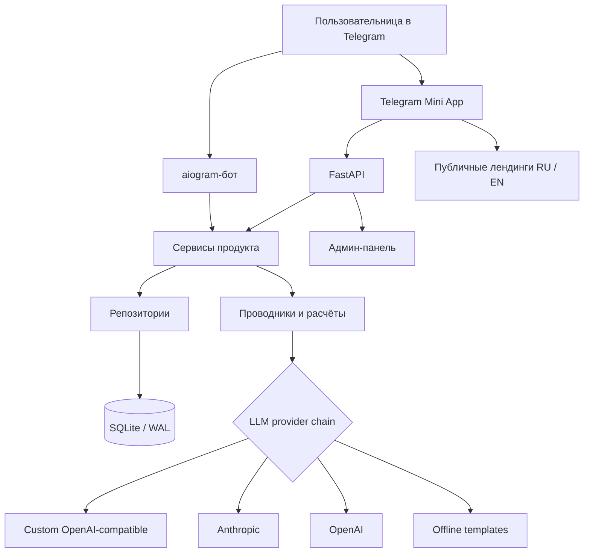
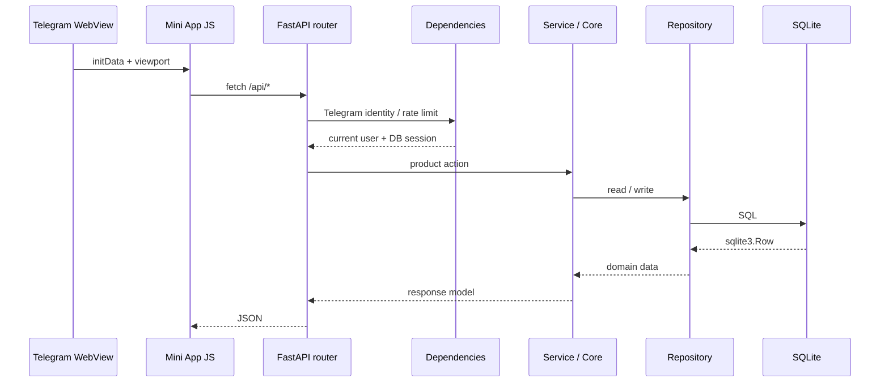

# Архитектура OracleAI

OracleAI построен как единый Python-домен с двумя пользовательскими поверхностями: Telegram-ботом и Telegram Mini App. Обе поверхности используют один SQLite-файл в WAL-режиме и общие сервисы; это устраняет расхождение бизнес-правил между ботом и веб-интерфейсом.[1]

## Границы компонентов

| Компонент | Ответственность | Ключевые каталоги |
|---|---|---|
| Telegram-бот | Онбординг, сообщения, уведомления, платежные сценарии и задачи бота. | `app/bot/` |
| Mini App | Мобильный интерфейс: «Сегодня», проводники, чат, профиль, инструменты. | `miniapp/` |
| HTTP API | Авторизация запроса, валидация входных данных, лимиты, JSON-контракты и статика. | `app/api/` |
| Доменные сервисы | Чат, лимиты, практики, аналитика, платежи, рефералы, планировщик. | `app/services/` |
| Ядро | Проводники, астрологические и карточные вычисления, safety, LLM runtime. | `app/core/` |
| Репозитории | SQL-доступ и маппинг строк БД без логики интерфейса. | `app/repo/` |
| Данные | DDL, миграции, начальное наполнение и SQLite-сессии. | `app/data/` |
| Операции | Docker Compose, reverse proxy, бэкапы и selfcheck. | `infra/`, `scripts/` |

## Серверный поток запроса

FastAPI создаёт соединение с БД на lifecycle-старте, применяет миграции через слой данных и монтирует Mini App на `/static`, а публичные стили — на `/public`.[2] Все роутеры из реестра включаются в единое приложение; API по умолчанию кэшироваться не должен, а статические ассеты получают короткий TTL.[2]

## Frontend

Frontend намеренно не использует сборщик: `miniapp/index.html` подключает нумерованные JavaScript-модули и единый `styles.css`, который формирует каскад из CSS-слоёв. Порядок файлов — часть архитектуры: базовые токены и shell идут раньше экранных стилей, а `15-ritual-redesign.css` является финальным визуальным слоем.[3]

| Набор | Роль |
|---|---|
| `01-utils.js` | Общие утилиты, словарь RU/EN, variant/exposure для экспериментов. |
| `02-art.js` – `04-nativity.js` | Визуальные ассеты, статические данные и натальные вычисления на клиенте. |
| `05-app.js` | Bootstrap, каркас, age-gate, переходы, viewport. |
| `06-home.js` – `12-misc.js` | Экраны «Сегодня», чат, виджеты, Таро, карта, совместимость, профиль. |
| `13-events.js` | Делегирование DOM-событий и маршрутизация действий `data-act`. |
| `14-gestures.js` | Pointer Events и свайп-навигация. |
| `00-tokens.css` – `15-ritual-redesign.css` | Токены, layout, экранные компоненты и финальный визуальный слой. |

Клиент вызывает API через общий слой `02-api.js`; интерфейс не должен дублировать серверные правила приватности, лимитов или доступа. Он может показывать состояние оптимистично, но сервер остаётся окончательным источником разрешений.

## Доменный слой и проводники

Пользовательские поверхности не обращаются к LLM напрямую. Runtime проводников получает профиль, языковое предпочтение, безопасный контекст и только разрешённую память, затем выбирает доступного провайдера. Цепочка провайдеров собирается из custom-совместимого API, Anthropic и OpenAI; если провайдеров нет, продукт предоставляет офлайн-ответ вместо аварийного завершения.[4]

Три клиентских проводника формируют разные точки входа в продукт: **Лилит** — общий бережный диалог, **Урания** — астрологические инсайты, **Мадам Ленорман** — карточные сценарии. Их тон и ответы обязаны оставаться интерпретацией для саморефлексии, а не обещанием результата или профессиональной консультацией.

## Данные и миграции

SQLite — транзакционный источник данных для пользователей, диалогов, памяти, дневников, раскладов, практик, платежей, аналитики, контента и административных действий. Полный DDL находится в `schema.py`; добавление колонок к живым таблицам выполняется через `migrations.py`, поскольку `CREATE TABLE IF NOT EXISTS` не изменяет существующую схему.[5]

| Группа таблиц | Примеры | Назначение |
|---|---|---|
| Профиль | `users`, `profile_summaries`, `memories` | Идентичность Telegram, предпочтения, согласия и память. |
| История | `threads`, `messages`, `diary`, `forecasts`, `reports` | Диалог и персональные материалы. |
| Практики | `tarot_readings`, `partners`, `practices` | Карты, совместимость и ежедневные действия. |
| Коммерция | `plans`, `orders`, `payments`, `entitlements` | Тарифы, покупки и права доступа. |
| Наблюдаемость | `events`, `llm_usage`, `safety_events` | Продуктовая аналитика, стоимость и safety-аудит. |
| Управление | `settings`, `content_items`, `feature_flags`, `admin_audit` | Контент, флаги и действия администрации. |

При работе с результатами SQLite нужно использовать доступ по ключу или индексу (`row["field"]`), а не метод `.get()`: возвращается `sqlite3.Row`, который не реализует словарный `.get()`.

## Границы доверия

| Зона | Доверенная информация | Обязательная защита |
|---|---|---|
| Telegram | Подписанная `initData`, Telegram ID. | Проверка подписи вне development-режима. |
| Browser / WebView | Любой текст, состояния формы и local storage. | Серверная валидация Pydantic, лимиты, экранирование. |
| API | Запрос с вычисленным пользователем. | Проверка доступа, rate limit и безопасные ошибки. |
| LLM | Интерпретация, не источник истины о пользователе. | Ограниченный контекст, privacy guard, safety-политики. |
| SQLite | Персональные данные и продуктовая история. | WAL, резервные копии, ограничение доступа к файлу, миграции. |

## Observability и деградация

`/api/health` возвращает состояние базы, доступность и цепочку LLM-провайдеров. Middleware добавляет `X-Response-Time`, логирует медленные и серверные ошибки, отправляет исключения в Sentry при наличии `SENTRY_DSN` и не показывает стек пользователю.[2] При неготовой LLM-цепочке API и бот продолжают отвечать офлайн-сценариями.[4]

## References

[1]: [app/api/main.py](../app/api/main.py) — общий API-процесс и комментарий о двух поверхностях.
[2]: [app/api/main.py](../app/api/main.py) — lifecycle, security headers, cache control и статическая раздача.
[3]: [miniapp/js/](../miniapp/js/) и [miniapp/css/](../miniapp/css/) — модульная архитектура клиентского интерфейса.
[4]: [app/config.py](../app/config.py) — выбор и fallback-цепочка LLM-провайдеров.
[5]: [app/data/schema.py](../app/data/schema.py) и [app/data/migrations.py](../app/data/migrations.py) — DDL и изменение существующих схем.
