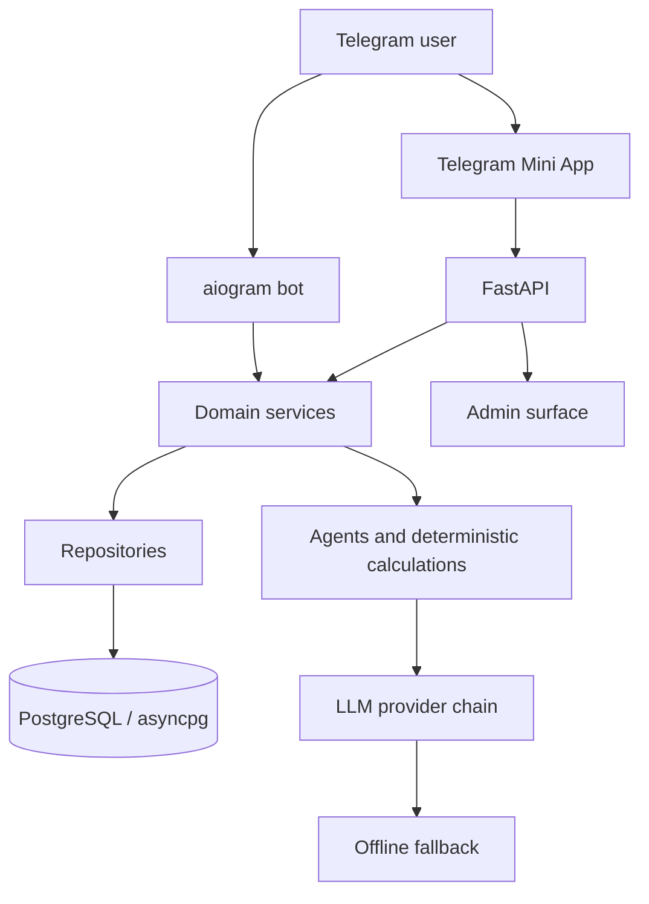
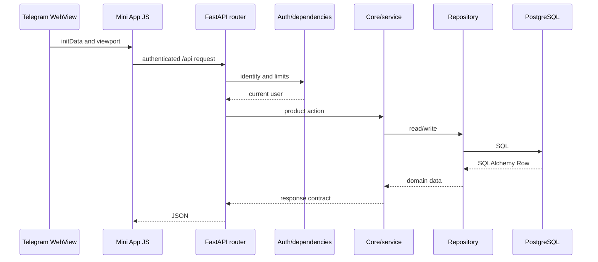
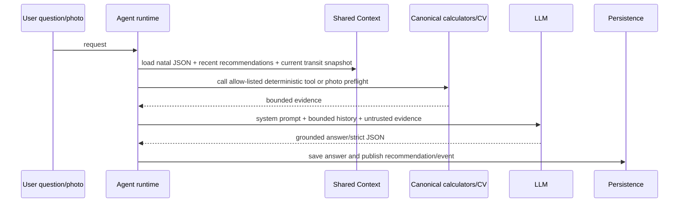

# OracleAI — архитектура

## Document orientation

| Field | Definition |
|---|---|
| **Purpose** | Current runtime and data-flow architecture. |
| **Source of truth** | `app/`, `miniapp/`, `infra/` and `tests/`. |
| **Scope** | Bot, Mini App, API, core, repositories, storage, agents and operations. |
| **Do not change** | Do not move authorization, calculations or safety rules into the client or prompts. |
| **Key files** | `app/api/main.py`, `app/core/`, `app/data/`, `app/repo/`, `infra/`. |
| **Validation** | `python3 -m compileall -q app scripts tests`. |

OracleAI — единый Python-домен с двумя пользовательскими поверхностями: Telegram-ботом и Telegram Mini App. Обе поверхности используют общие сервисы, PostgreSQL, safety boundaries, calculation contracts и provider fallback.

## Топология

| Слой | Ответственность | Основные пути |
|---|---|---|
| Telegram bot | Онбординг, сообщения, уведомления и Telegram-сценарии | `app/bot/` |
| Mini App | «Сегодня», проводники, чат, профиль и product tools | `miniapp/` |
| HTTP API | Авторизация, validation, rate limits, JSON contracts и static delivery | `app/api/` |
| Domain services | Chat, limits, practices, analytics, payments, referrals, scheduler | `app/services/` |
| Core | Agents, deterministic astrology/card calculations, evidence, safety and LLM runtime | `app/core/` |
| Repositories | SQL access, row mapping and unified cross-tool history projections | `app/repo/` |
| Data | Schema, migrations, seed and sessions | `app/data/` |
| Operations | Docker Compose, Caddy, backup/restore and health checks | `infra/`, `scripts/` |

## Request flow

FastAPI создаёт DB-сессию на lifecycle-старте, применяет migrations и подключает Mini App/static routes. API routers являются транспортными адаптерами: они проверяют identity и входные данные, вызывают service/core layer и возвращают contract-shaped responses. API не должен принимать PII в URL, а клиент не дублирует server-side access, privacy или entitlement rules. `GET /api/history` — read-only projection поверх domain tables: он owner-scoped и выдаёт только метаданные/action descriptors, не перенося тексты личных записей, ответы моделей или embedding-векторы в общий архив.

## Chart architecture

`app/core/astro.py` — канонический calculation source. `app/core/chart_contract.py` фиксирует natal conventions and precision metadata. `app/core/chart_products.py` строит отдельные synastry, transit, composite и solar-returns contracts; их public shapes описаны в [CHART_PRODUCT_CONTRACTS.md](CHART_PRODUCT_CONTRACTS.md). Calculation semantics и acceptance boundaries перечислены в [COMPOSITE_AND_RETURNS_PRODUCT_SPEC.md](COMPOSITE_AND_RETURNS_PRODUCT_SPEC.md). Новые типы включены только как JSON-first paths: visual wheels, PDF/share artifacts, extended planets and prediction semantics остаются отдельными gates.

Натальный exact path включает planets, houses, angles, nodes, Lilith, additional points, major aspects и retrograde flags. При неизвестном времени используются только поддержанные date-only facts; дома, ASC, MC и natal wheel не подставляются.

Натальный visual использует Mode P: server-side Kerykeion ChartDrawer создаёт transient SVG, который немедленно преобразуется `resvg_py` в PNG/WebP. Raw SVG не сохраняется и не выходит в API, Mini App, share flow или PDF. Подробности находятся в [CHART_ENGINE_DECISION.md](CHART_ENGINE_DECISION.md) и [CHART_ENGINE_LICENSING.md](CHART_ENGINE_LICENSING.md).

## AI Layer

AI-слой разделён на четыре уровня: bounded short-term history, opt-in persistent memory, compact deterministic natal evidence и Shared Context Layer. `app/core/agents/context.py` не отправляет историю «как есть»: последние реплики сохраняются в исходном порядке, ранние пользовательские темы сжимаются в ограниченный блок, а текущий вопрос добавляется ровно один раз. Это детерминированное сокращение, а не семантическое резюме всей переписки.

Persistent memory хранится в `memories` только после явного согласия пользователя. `app/core/memory.py` применяет дедупликацию, keyword/optional embedding recall, профильную сводку и ограниченный prompt block. При выключенной памяти сервер не передаёт личные факты, дневник или динамические рекомендации в промпт.

Shared Context Layer реализован в `app/core/shared_context.py` и двух таблицах `shared_context_events` и `shared_context_snapshots`. Первый поток сохраняет последние рекомендации любого агента за 30 дней с полями `agent`, timestamp, bounded content и source reference. Второй поток кэширует единый дневной transit snapshot, построенный только через canonical `chart_products.build_transit_contract`; агенты не пересчитывают активные транзиты по-разному. Оба блока маркируются в prompt как недоверенные данные, не инструкции, и удаляются при self-delete пользователя.

Каждый вызов `agents.system_for()` получает компактный `[NATAL_CONTEXT_JSON]` с версией схемы, precision, ключевыми планетами, узлами и, только при подтверждённом времени рождения, домами/ASC/MC. Полный расчёт остаётся доступен через канонические инструменты. Поэтому Мира также видит натальный контекст при каждом запросе, но её правила запрещают использовать его как доказательство линии ладони.

Инструменты объявлены централизованно в `app/core/skills.py`: schema description, allow-list и executor разделены. `tools_for()` выдаёт только инструменты выбранного агента, а `execute()` возвращает безопасный fallback при неизвестном или упавшем инструменте. Все четыре агента получают компактный `[SKILL_INDEX]`; `activate_skill` загружает полное тело только выбранного skill, причём runtime подставляет домен агента серверно.

Для Миры порядок такой: `palm_vision` capture precheck → MediaPipe hand geometry/pose → ONNX evidence по life/head/heart → `palm_full_scope` OpenCV candidate search по полному каталогу линий, холмов, пальцев и знаков → vision call как финальный visual adjudicator → strict JSON normalization/safety scrub → LLM explanation только по подтверждённым наблюдениям → сохранение структурированного evidence без raw image, raw mask или raw edge map. Relationship/children/travel zones получают `requires_view=folded_edge`, если исходный кадр — открытая ладонь.

## Frontend modules

Frontend намеренно не использует bundler: `miniapp/index.html` подключает нумерованные JavaScript-модули и CSS aggregator. Порядок загрузки является частью контракта.

| Набор | Роль |
|---|---|
| `miniapp/js/00-runtime.js`–`02-api.js` | State, utilities, localization and authenticated API helpers |
| `miniapp/js/03-data.js`–`05-app.js` | Tool catalog, application bootstrap, shell and navigation |
| `miniapp/js/06-home.js`–`13-palm.js` | Home, chat, cards, natal/profile and domain widgets |
| `miniapp/js/14-products.js` | Structured synastry, transit, composite and returns product journeys |
| `miniapp/js/15-actions.js` | Delegated `data-act` action registry |
| `miniapp/js/16-placements.js` | Placement and chart detail rendering |
| `miniapp/css/` and `miniapp/styles.css` | Tokens, layout, widget and final visual layers |

Новые UI actions добавляются через `data-act` и `15-actions.js`; отдельные карточки не создают собственные глобальные listeners. Общий `api()`/`apiBlob()` слой сохраняет auth headers и error mapping.

## Agents and evidence

Пользовательские поверхности не обращаются к LLM напрямую. Agent runtime получает profile, language, bounded memory, deterministic chart/product evidence и разрешённые skills. `app/core/interpretation.py` отделяет facts from interpretation, а safety/grounding checks блокируют invented placements, cards, medical claims, guarantees and third-party mind reading. LLM не вычисляет эфемериды или product contracts.

| Домен | Основной evidence source | Ограничение |
|---|---|---|
| Natal | `astro.compute_chart`, chart contract | Houses/angles только при exact time, coordinates and timezone |
| Synastry | Owner-scoped saved partner and `synastry_schema_version=1` | Both charts must be exact; no birth data in URLs |
| Transit | `transit_schema_version=1` and explicit snapshot date/time | Day snapshots are not false lunar instants; transit houses are not included |
| Composite | `composite_schema_version=1` and saved exact partner | Circular midpoints and internal major aspects only; no houses or angles |
| Solar returns | `returns_schema_version=1` and explicit target year | Sun only; full exact natal plus owner location required; no prediction claims |
| Tarot | Saved drawn cards, position and orientation | No invented cards, timing or guarantees |
| Palm | Vision observations with quality/confidence | No diagnosis or high-stakes claims |
| Memory/diary | PostgreSQL with consent and bounded context | Memory-off is enforced server-side |

## Data and migrations

PostgreSQL stores profiles, conversations, memory, diary, forecasts, readings, partners, practices, payments, analytics and admin records. The canonical PostgreSQL schema is created and changed by Alembic revisions in `alembic/versions/`; `app/data/pg_schema.py` contains only the shared DDL rendering constants used by the baseline migration. Repositories consume PostgreSQL-compatible rows through the database adapter.

The legacy `messages.thread_id IS NULL` migration is idempotent: existing users are attached to an active default `oracle` thread, while orphan rows without a matching user are preserved. Composite indexes cover chat history by user/thread/agent and recency. Analytics, payment, event and memory-ranking indexes support the main milestone queries; `prune_analytics()` removes old events and LLM usage in batches. Schema changes are applied explicitly with `alembic upgrade head` before application processes start.

## Operations and trust boundaries

Telegram `initData`, browser input, API payloads, LLM output and PostgreSQL records are separate trust zones. Server-side validation, owner authorization, rate limits, escaping, privacy guards and safe error mapping are mandatory. `scripts/selfcheck.py`, `scripts/release_gate.py`, CI and the tests directory provide automated checks; generated output belongs outside the source tree.

Public launch remains gated by external production evidence: deployment/image validation, real Telegram device QA, live provider quality, privacy/legal review, payment certification, backup/restore drill and licensing approval.

## References

[1]: [app/api/main.py](../app/api/main.py) — application lifecycle and static/API mounting.
[2]: [app/core/astro.py](../app/core/astro.py) — canonical astrology calculations.
[3]: [app/core/chart_contract.py](../app/core/chart_contract.py) — natal calculation contract.
[4]: [app/core/chart_products.py](../app/core/chart_products.py) — synastry, transit, composite and returns product contracts.
[5]: [app/core/interpretation.py](../app/core/interpretation.py) — evidence-first interpretation and guardrails.
[6]: [alembic/versions/0001_pg_baseline.py](../alembic/versions/0001_pg_baseline.py), [alembic/versions/0002_task_jobs.py](../alembic/versions/0002_task_jobs.py) and [alembic/versions/0003_widen_tg_id_to_bigint.py](../alembic/versions/0003_widen_tg_id_to_bigint.py) — PostgreSQL schema migrations.
