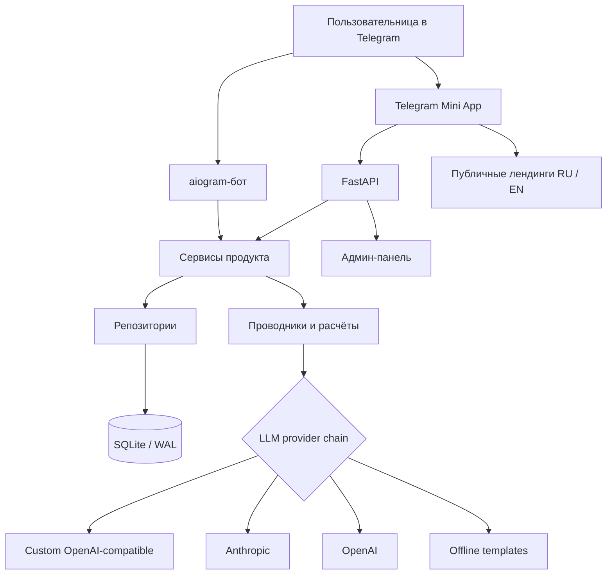
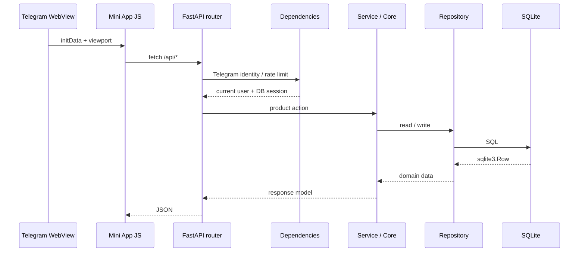

# Архитектура OracleAI

OracleAI построен как единый Python-домен с двумя пользовательскими поверхностями: Telegram-ботом и Telegram Mini App. Обе поверхности используют один SQLite-файл в WAL-режиме и общие сервисы; это устраняет расхождение бизнес-правил между ботом и веб-интерфейсом.[1]

## Границы компонентов

| Компонент | Ответственность | Ключевые каталоги |
|---|---|---|
| Telegram-бот | Онбординг, сообщения, уведомления, платежные сценарии и задачи бота. | `app/bot/` |
| Mini App | Мобильный интерфейс: «Сегодня», проводники, чат, профиль, инструменты. | `miniapp/` |
| HTTP API | Авторизация запроса, валидация входных данных, лимиты, JSON-контракты и статика. | `app/api/` |
| Доменные сервисы | Чат, лимиты, практики, аналитика, платежи, рефералы, планировщик. | `app/services/` |
| Ядро | Проводники, астрологические и карточные вычисления, evidence-first grounding, safety и LLM runtime. | `app/core/`, включая `interpretation.py` |
| Репозитории | SQL-доступ и маппинг строк БД без логики интерфейса. | `app/repo/` |
| Данные | DDL, миграции, начальное наполнение и SQLite-сессии. | `app/data/` |
| Операции | Docker Compose, reverse proxy, бэкапы и selfcheck. | `infra/`, `scripts/` |

## Серверный поток запроса

FastAPI создаёт соединение с БД на lifecycle-старте, применяет миграции через слой данных и монтирует Mini App на `/static`, а публичные стили — на `/public`.[2] Все роутеры из реестра включаются в единое приложение; API по умолчанию кэшироваться не должен, а статические ассеты получают короткий TTL.[2]

## Frontend

Frontend намеренно не использует сборщик: `miniapp/index.html` подключает нумерованные JavaScript-модули и единый `styles.css`, который формирует каскад из CSS-слоёв. Порядок файлов — часть архитектуры: базовые токены и shell идут раньше экранных стилей, а `15-ritual-redesign.css` является финальным визуальным слоем.[3]

| Набор | Роль |
|---|---|
| `00-runtime.js` | Единый mutable state и legacy-facade для безопасной постепенной миграции. |
| `01-utils.js` | Общие утилиты, словарь RU/EN, variant/exposure для экспериментов. |
| `02-art.js` – `04-nativity.js` | Визуальные ассеты, статические данные и натальные вычисления на клиенте. |
| `05-app.js` | Bootstrap, shell, age-gate, navigation и viewport. |
| `06-home.js` – `12-misc.js` | Экраны «Сегодня», чат, виджеты, Таро, карта, совместимость, профиль. |
| `13-events.js` | Тонкий DOM transport: click/keydown/input → action registry. |
| `14-gestures.js` | Pointer Events и свайп-навигация. |
| `15-actions.js` | Data-driven registry для `data-act`, без гигантского switch в event layer. |
| `00-tokens.css` – `15-ritual-redesign.css` | Токены, layout, экранные компоненты и финальный визуальный слой. |

Клиент вызывает API через общий слой `02-api.js`; интерфейс не должен дублировать серверные правила приватности, лимитов или доступа. Он может показывать состояние оптимистично, но сервер остаётся окончательным источником разрешений.

### Новые правила frontend-модулей

`window.app` остаётся временным публичным фасадом для существующих экранов, но изменяемые данные находятся в `app.state`. Новые функции не должны создавать собственные глобальные поля или слушатели на отдельных карточках: действие объявляется через `data-act`, а его mapping добавляется в `15-actions.js`. DOM-события, view-логика и состояние таким образом имеют разные точки изменения.

На backend API-роутеры являются транспортными адаптерами. DTO находятся в `app/api/contracts/`, общие HTTP-помощники — в `app/api/common/`, прикладные сценарии — в `app/services/`, доменные вычисления — в `app/core/`. Роутеры не импортируют друг друга. Например, `/api/compat` и `/api/compat/full` используют `app/services/compatibility.py`, а `/api/share/compat.png` использует общий validator и публичный domain API skills.

## Доменный слой и проводники

Пользовательские поверхности не обращаются к LLM напрямую. Runtime проводников получает профиль, языковое предпочтение, безопасный контекст и только разрешённую память, затем выбирает доступного провайдера. Цепочка провайдеров собирается из custom-совместимого API, Anthropic и OpenAI; если провайдеров нет, продукт предоставляет офлайн-ответ вместо аварийного завершения.[4]

Три клиентских проводника формируют разные точки входа в продукт: **Лилит** — общий бережный диалог, **Урания** — астрологические инсайты, **Мадам Ленорман** — карточные сценарии. Их тон и ответы обязаны оставаться интерпретацией для саморефлексии, а не обещанием результата или профессиональной консультацией.

### Evidence-first интерпретации

`app/core/interpretation.py` отделяет **детерминированно рассчитанные факты** от текста модели. Перед каждым LLM-сценарием оркестратор собирает закрытый evidence block и передаёт его вместе с вопросом и разрешённым контекстом. После генерации grounding-проверка отклоняет текст, который выдаёт несуществующие карты, планеты, дома или аспекты. Это правило действует для натала, Таро, совместимости, отчётов и monthly-сценариев.[6]

| Сценарий | Разрешённые факты | Ограничение точности |
|---|---|---|
| Натальная карта | Вычисленные планеты, знаки, аспекты; дома и углы только при известном времени. | При `time_known=false` интерфейс, API, бот и PDF используют date-only режим без ASC, MC и домов. |
| Таро | Вытянутые карты, их позиции, ориентация, вопрос и схема расклада. | Нельзя добавлять невыпавшие карты, точные сроки или намерения третьих лиц. |
| Совместимость и отчёты | Детерминированные расчёты, разрешённые синастрические факты, контекст запроса. | Нельзя обещать исход отношений или подменять интерпретацией профессиональную консультацию. |

Frontend сохраняет это различие в подаче: карточка карты показывает краткий вывод перед раскрываемыми фактами, а завершённый расклад отображает связи позиций через «нить расклада». Клиент не рассчитывает и не изобретает дополнительные факты, а отображает контракт API.[3]

## Данные и миграции

SQLite — транзакционный источник данных для пользователей, диалогов, памяти, дневников, раскладов, практик, платежей, аналитики, контента и административных действий. Полный DDL находится в `schema.py`; добавление колонок к живым таблицам выполняется через `migrations.py`, поскольку `CREATE TABLE IF NOT EXISTS` не изменяет существующую схему.[5]

| Группа таблиц | Примеры | Назначение |
|---|---|---|
| Профиль | `users`, `profile_summaries`, `memories` | Идентичность Telegram, предпочтения, согласия и память. |
| История | `threads`, `messages`, `diary`, `forecasts`, `reports` | Диалог и персональные материалы. |
| Практики | `tarot_readings`, `partners`, `practices` | Карты, совместимость и ежедневные действия. |
| Коммерция | `plans`, `orders`, `payments`, `entitlements` | Тарифы, покупки и права доступа. |
| Наблюдаемость | `events`, `llm_usage`, `safety_events` | Продуктовая аналитика, стоимость и safety-аудит. |
| Управление | `settings`, `content_items`, `feature_flags`, `admin_audit` | Контент, флаги и действия администрации. |

При работе с результатами SQLite нужно использовать доступ по ключу или индексу (`row["field"]`), а не метод `.get()`: возвращается `sqlite3.Row`, который не реализует словарный `.get()`.

## Границы доверия

| Зона | Доверенная информация | Обязательная защита |
|---|---|---|
| Telegram | Подписанная `initData`, Telegram ID. | Проверка подписи вне development-режима. |
| Browser / WebView | Любой текст, состояния формы и local storage. | Серверная валидация Pydantic, лимиты, экранирование. |
| API | Запрос с вычисленным пользователем. | Проверка доступа, rate limit и безопасные ошибки. |
| LLM | Интерпретация, не источник истины о пользователе. | Ограниченный контекст, privacy guard, safety-политики. |
| SQLite | Персональные данные и продуктовая история. | WAL, резервные копии, ограничение доступа к файлу, миграции. |

## Observability и деградация

`/api/health` возвращает состояние базы, доступность и цепочку LLM-провайдеров. Middleware добавляет `X-Response-Time`, логирует медленные и серверные ошибки, отправляет исключения в Sentry при наличии `SENTRY_DSN` и не показывает стек пользователю.[2] При неготовой LLM-цепочке API и бот продолжают отвечать офлайн-сценариями.[4]

## References

[1]: [app/api/main.py](../app/api/main.py) — общий API-процесс и комментарий о двух поверхностях.
[2]: [app/api/main.py](../app/api/main.py) — lifecycle, security headers, cache control и статическая раздача.
[3]: [miniapp/js/](../miniapp/js/) и [miniapp/css/](../miniapp/css/) — модульная архитектура клиентского интерфейса.
[4]: [app/config.py](../app/config.py) — выбор и fallback-цепочка LLM-провайдеров.
[5]: [app/data/schema.py](../app/data/schema.py) и [app/data/migrations.py](../app/data/migrations.py) — DDL и изменение существующих схем.
[6]: [docs/INTERPRETATION_QUALITY_STANDARD.md](INTERPRETATION_QUALITY_STANDARD.md) и [app/core/interpretation.py](../app/core/interpretation.py) — контракт evidence-first, calibration и guardrails.

## Audit baseline — 2026-08-25

Read-only checkout confirmed the documented Python monolith structure: FastAPI and aiogram share domain services and SQLite/WAL; the Mini App is unbundled Vanilla JavaScript with ordered modules under `miniapp/js/` and CSS layers under `miniapp/css/`. The natal path is `app/api/routers/chart.py` → `app/core/astro.py` → `app/core/agent.py`/`app/core/interpretation.py` → `miniapp/js/04-nativity.js` or `app/pdfgen/builder.py`.

The calculation source of truth is currently Kerykeion 5.12.9 over Swiss Ephemeris. Production conventions are explicit: Tropical zodiac, Placidus `P`, Apparent Geocentric perspective and True Node mode. The API exposes `natal_schema_version: 2`, precision modes, exact and rounded values, houses/angles only when time, coordinates and timezone are confirmed, plus nodes and additional points when supported by the installed library. The calculation contract is not yet extracted into a separate `CalculationConfig`/canonical DTO, and aspect policy/orbs are not represented as a first-class versioned object.

The fixed natal interpretation already follows an evidence-first pattern with grounding and coverage gates, but the public result remains Markdown text with eight sections rather than strict JSON Schema. Follow-up free chat receives a chart brief through the selected agent runtime; a dedicated chart-context follow-up contract and tests for “no invented placement” remain to be implemented.

The frontend wheel is manually generated SVG with animated groups, planet/node glyphs and aspect lines. It is responsive through a `viewBox` and size scaling, but the current implementation uses fixed radial geometry, shows only a subset of aspects, does not perform deterministic collision avoidance for close planets, has limited semantic labeling, and does not yet expose a complete legend or distinct style policy for all aspect types. The PDF builder is a separate HTML template rendered by WeasyPrint; it already has RU/EN copy tables and evidence-based sections, but the requested premium page architecture, print QA and renderer decision are incomplete.

Agent routing is explicit selection plus skill narrowing, not a central free-text intent classifier. The current registry contains four agents: Лилит (`oracle`), Урания (`astro`), Мадам Ленорман (`tarot`) and Мира (`chiromant`). The complete routing matrix and UI/tool presentation audit remain open.

### Baseline commands

`pytest -q` passed after installing the pinned development dependencies. `python3 -m scripts.selfcheck` completed successfully; the live LLM probe was skipped because `SELF_CHECK_LIVE=1` was not enabled, while the configured proxy returned empty responses during the self-check's optional provider calls and the product correctly used offline fallbacks. The sandbox did not contain Telegram bot credentials or a production `WEBAPP_URL`, so external Telegram flows were not exercised.

## Implementation iteration — canonical chart contract and interpretation

`app/core/chart_contract.py` now defines a versioned calculation metadata contract with explicit Tropical/Placidus/Apparent Geocentric/True Node conventions, active points, major-aspect angles and per-type orbs. `app/core/astro.py` attaches this contract to both full and lite results, preserves exact values beside rounded UI values, suppresses technical noon as confirmed birth time, and filters returned major aspects against the declared orb policy. The API exposes a backward-compatible `calculation` object alongside the existing `natal_schema_version: 2` fields.

`miniapp/js/04-nativity.js` now renders a canonical-data-driven SVG with sign glyphs/names, true house cusp arcs, semantic aspect styles, node labels, zero-degree-safe geometry, deterministic radial lanes for close points, `title`/ARIA labels, responsive `viewBox`, and existing animation/reduced-motion hooks. The CSS module adds the semantic layer tokens and motion fallback.

`app/core/chart_interpretation.py` defines a strict structured contract for personality synthesis, Rahu/Ketu, strengths, weaknesses, purpose, relationships, career/money, aspects, periods and synthesis. The canonical chart path requests JSON-only output, validates shape/lengths and evidence constraints, caches the structured payload, and renders backward-compatible rich text. Legacy charts without the new calculation metadata remain on the previous text path until migrated.

## Implementation iteration — deterministic routing and specialist handoff

`app/core/agents/routing.py` provides a bounded RU/EN/code-switched classifier based on explainable domain terms. It distinguishes hard specialist conflicts from soft Oracle context, keeps ambiguous/off-topic questions on the default agent, and exposes confidence/candidates/reason. `app/services/chat.py` applies the route only when the requested agent is the default; explicit agent paths remain authoritative. API responses now expose `requested_agent`, final `agent`, and applied routing metadata. The Mini App consumes that metadata to show a localized handoff badge and switch the active header to the specialist thread.

The routing matrix contains 24 cases and passes 24/24. Existing specialist benchmarks remain separate evidence for skill selection, Vedic routing, Mira/Lenormand routing and persona quality. This design avoids an additional LLM intent call and therefore does not add latency or a new failure mode to the paid chat path.

## Current release iteration — ToV, PDF and visual layer — 2026-08-25

Active user-facing and prompt surfaces use a confident evidence-first voice: a deterministic placement, drawn card, observed palm feature or calculated relationship signal is connected to a clear interpretation and a practical next step. Generic rationalizing language is not part of ordinary output. The shared runtime still applies `app/core/safety.py`, high-stakes boundaries, privacy/age/crisis protections and grounding rules; data availability is communicated as a calculation fact, such as date-only mode when birth time is absent.

The PDF layer remains WeasyPrint HTML→PDF. `layout.py` defines body `12.4pt` / `1.56` line-height, H2 `24pt`, H3 `17pt`, and compact reference/chapter columns. `builder.py` composes the cover, wheel/matrix overview, full calculation reference, five paired thematic blocks and closing. Three deterministic profiles in RU/EN produced six valid pages per document; the six-page result is accepted because readability and complete reference content take priority over shrinking the main text.

The Mini App natal wheel remains the project’s own SVG renderer in `miniapp/js/04-nativity.js`. It consumes the canonical chart contract directly and owns collision lanes, semantic aspect styles, accessible labels, responsive viewBox and reduced-motion behavior. AstroChart 3.0.2 and Kerykeion 5.12.9 renderers were executed as external references; neither is loaded by the product runtime. See [ADR-006/007](DECISIONS.md) and [ToV/PDF/renderer report](audit/TOV_PDF_RENDERER_REPORT_2026-08-25.md).
