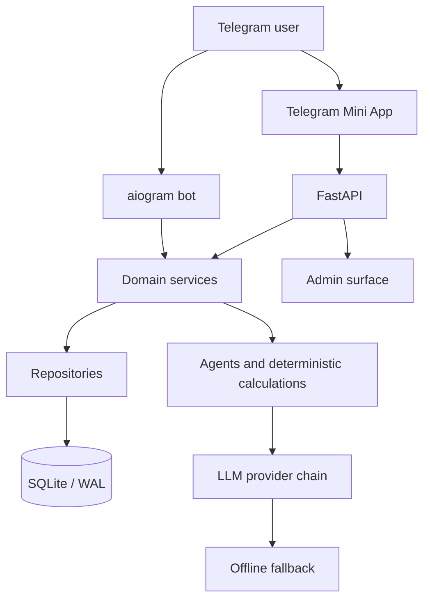
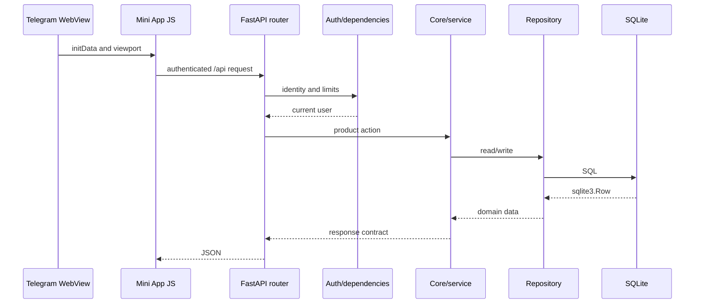

# OracleAI — архитектура

OracleAI — единый Python-домен с двумя пользовательскими поверхностями: Telegram-ботом и Telegram Mini App. Обе поверхности используют общие сервисы, SQLite/WAL, safety boundaries, calculation contracts и provider fallback.

## Топология

| Слой | Ответственность | Основные пути |
|---|---|---|
| Telegram bot | Онбординг, сообщения, уведомления и Telegram-сценарии | `app/bot/` |
| Mini App | «Сегодня», проводники, чат, профиль и product tools | `miniapp/` |
| HTTP API | Авторизация, validation, rate limits, JSON contracts и static delivery | `app/api/` |
| Domain services | Chat, limits, practices, analytics, payments, referrals, scheduler | `app/services/` |
| Core | Agents, deterministic astrology/card calculations, evidence, safety and LLM runtime | `app/core/` |
| Repositories | SQL access, row mapping and unified cross-tool history projections | `app/repo/` |
| Data | Schema, migrations, seed and sessions | `app/data/` |
| Operations | Docker Compose, Caddy, backup/restore and health checks | `infra/`, `scripts/` |

## Request flow

FastAPI создаёт DB-сессию на lifecycle-старте, применяет migrations и подключает Mini App/static routes. API routers являются транспортными адаптерами: они проверяют identity и входные данные, вызывают service/core layer и возвращают contract-shaped responses. API не должен принимать PII в URL, а клиент не дублирует server-side access, privacy или entitlement rules. `GET /api/history` — read-only projection поверх domain tables: он owner-scoped и выдаёт только метаданные/action descriptors, не перенося тексты личных записей, ответы моделей или embedding-векторы в общий архив.

## Chart architecture

`app/core/astro.py` — канонический calculation source. `app/core/chart_contract.py` фиксирует natal conventions and precision metadata. `app/core/chart_products.py` строит отдельные synastry, transit, composite и solar-returns contracts; их public shapes описаны в [CHART_PRODUCT_CONTRACTS.md](CHART_PRODUCT_CONTRACTS.md). Calculation semantics и acceptance boundaries перечислены в [COMPOSITE_AND_RETURNS_PRODUCT_SPEC.md](COMPOSITE_AND_RETURNS_PRODUCT_SPEC.md). Новые типы включены только как JSON-first paths: visual wheels, PDF/share artifacts, extended planets and prediction semantics остаются отдельными gates.

Натальный exact path включает planets, houses, angles, nodes, Lilith, additional points, major aspects и retrograde flags. При неизвестном времени используются только поддержанные date-only facts; дома, ASC, MC и natal wheel не подставляются.

Натальный visual использует Mode P: server-side Kerykeion ChartDrawer создаёт transient SVG, который немедленно преобразуется `resvg_py` в PNG/WebP. Raw SVG не сохраняется и не выходит в API, Mini App, share flow или PDF. Подробности находятся в [CHART_ENGINE_DECISION.md](CHART_ENGINE_DECISION.md) и [CHART_ENGINE_LICENSING.md](CHART_ENGINE_LICENSING.md).

## Frontend modules

Frontend намеренно не использует bundler: `miniapp/index.html` подключает нумерованные JavaScript-модули и CSS aggregator. Порядок загрузки является частью контракта.

| Набор | Роль |
|---|---|
| `miniapp/js/00-runtime.js`–`02-api.js` | State, utilities, localization and authenticated API helpers |
| `miniapp/js/03-data.js`–`05-app.js` | Tool catalog, application bootstrap, shell and navigation |
| `miniapp/js/06-home.js`–`13-palm.js` | Home, chat, cards, natal/profile and domain widgets |
| `miniapp/js/14-products.js` | Structured synastry, transit, composite and returns product journeys |
| `miniapp/js/15-actions.js` | Delegated `data-act` action registry |
| `miniapp/js/16-placements.js` | Placement and chart detail rendering |
| `miniapp/css/` and `miniapp/styles.css` | Tokens, layout, widget and final visual layers |

Новые UI actions добавляются через `data-act` и `15-actions.js`; отдельные карточки не создают собственные глобальные listeners. Общий `api()`/`apiBlob()` слой сохраняет auth headers и error mapping.

## Agents and evidence

Пользовательские поверхности не обращаются к LLM напрямую. Agent runtime получает profile, language, bounded memory, deterministic chart/product evidence и разрешённые skills. `app/core/interpretation.py` отделяет facts from interpretation, а safety/grounding checks блокируют invented placements, cards, medical claims, guarantees and third-party mind reading. LLM не вычисляет эфемериды или product contracts.

| Домен | Основной evidence source | Ограничение |
|---|---|---|
| Natal | `astro.compute_chart`, chart contract | Houses/angles только при exact time, coordinates and timezone |
| Synastry | Owner-scoped saved partner and `synastry_schema_version=1` | Both charts must be exact; no birth data in URLs |
| Transit | `transit_schema_version=1` and explicit snapshot date/time | Day snapshots are not false lunar instants; transit houses are not included |
| Composite | `composite_schema_version=1` and saved exact partner | Circular midpoints and internal major aspects only; no houses or angles |
| Solar returns | `returns_schema_version=1` and explicit target year | Sun only; full exact natal plus owner location required; no prediction claims |
| Tarot | Saved drawn cards, position and orientation | No invented cards, timing or guarantees |
| Palm | Vision observations with quality/confidence | No diagnosis or high-stakes claims |
| Memory/diary | SQLite with consent and bounded context | Memory-off is enforced server-side |

## Data and migrations

SQLite stores profiles, conversations, memory, diary, forecasts, readings, partners, practices, payments, analytics and admin records. DDL is defined in `app/data/schema.py`; changes to existing tables use `app/data/migrations.py`. Code must access `sqlite3.Row` by key/index and not call `.get()`.

## Operations and trust boundaries

Telegram `initData`, browser input, API payloads, LLM output and SQLite records are separate trust zones. Server-side validation, owner authorization, rate limits, escaping, privacy guards and safe error mapping are mandatory. `scripts/selfcheck.py`, `scripts/release_gate.py`, CI and the tests directory provide automated checks; generated output belongs outside the source tree.

Public launch remains gated by external production evidence: deployment/image validation, real Telegram device QA, live provider quality, privacy/legal review, payment certification, backup/restore drill and licensing approval.

## References

[1]: [app/api/main.py](../app/api/main.py) — application lifecycle and static/API mounting.
[2]: [app/core/astro.py](../app/core/astro.py) — canonical astrology calculations.
[3]: [app/core/chart_contract.py](../app/core/chart_contract.py) — natal calculation contract.
[4]: [app/core/chart_products.py](../app/core/chart_products.py) — synastry, transit, composite and returns product contracts.
[5]: [app/core/interpretation.py](../app/core/interpretation.py) — evidence-first interpretation and guardrails.
[6]: [app/data/schema.py](../app/data/schema.py) and [app/data/migrations.py](../app/data/migrations.py) — data schema and migrations.
