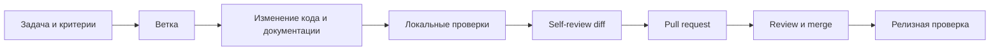

# Участие в разработке OracleAI

## Цель

Этот документ задаёт минимальный инженерный стандарт для каждого изменения OracleAI. Приоритеты: **безопасность пользовательницы, совместимость Telegram Mini App, целостность данных и проверяемость релиза**. Небольшое изменение интерфейса может затрагивать кэш, локализацию, safe area, privacy или backend-контракт — поэтому «работает у меня» недостаточно.

## Перед началом

1. Прочитайте [PRODUCT.md](PRODUCT.md), [DESIGN_SYSTEM.md](DESIGN_SYSTEM.md) и [SECURITY.md](SECURITY.md) для затрагиваемого сценария.
2. Создайте рабочую ветку от актуального `main`.
3. Не добавляйте секреты, production DB, Telegram initData, личные чаты, дневники или screenshot с PII.
4. Для неоднозначной продуктовой логики сначала согласуйте решение с владельцем продукта.

## Ветки и коммиты

| Задача | Имя ветки | Пример сообщения коммита |
|---|---|---|
| Пользовательская функция | `feat/<short-name>` | `feat: add daily ritual completion state` |
| Исправление | `fix/<short-name>` | `fix: keep composer above keyboard` |
| Документация | `docs/<short-name>` | `docs: refresh API contract` |
| Техдолг / рефакторинг | `refactor/<short-name>` | `refactor: isolate profile consent mapping` |
| Безопасность | `security/<short-name>` | `security: guard diary context when memory is off` |

Коммит содержит одну логичную цель, сформулирован в повелительном наклонении и не смешивает рефакторинг с не связанным пользовательским изменением. Нельзя переписывать опубликованную историю `main` без явного одобрения владельца репозитория.

## Рабочий процесс



| Шаг | Что требуется |
|---|---|
| Контракт | Назвать пользовательское состояние, API/БД-изменения и критерий успеха. |
| Реализация | Сохранить архитектурную границу: router → service/core → repo, UI → API layer. |
| Документация | Обновить файл из `docs/`, если изменились продукт, API, безопасность, дизайн или операция. |
| Проверка | Прогнать релевантные тесты, синтаксис и ручной mobile QA. |
| Review | Просмотреть `git diff`, проверить PII/secrets и обратную совместимость. |
| Merge | Только после review и подтверждённых проверок. |

## Backend: правила кода

* Используйте type hints, Pydantic для входных данных и явные `HTTPException` с безопасными текстами.
* Router отвечает за HTTP и dependencies; бизнес-правило находится в service/core; SQL — в repo/data.
* Не импортируйте один API-router из другого. Общий HTTP-код размещается в `app/api/common/`, DTO — в `app/api/contracts/`, workflow из нескольких операций — в `app/services/`.
* Любой пользовательский ресурс проверяет ownership на сервере. Нельзя доверять `tg_id`, plan, price или permission из тела браузерного запроса.
* Любая mutation получает соответствующий `rate_limit`; LLM-путь использует категорию `llm`.
* При новой колонке обновляйте DDL **и** миграцию для существующей SQLite БД. `CREATE TABLE IF NOT EXISTS` не изменяет старую таблицу.[1]
* Результаты SQLite имеют тип `sqlite3.Row`; используйте `row["field"]`, не `row.get("field")`.
* Не добавляйте контекст дневника/памяти в агентный путь без server-side проверки `memory_enabled`.
* Новое административное действие нуждается в ограничении роли и audit trail.

## Frontend: правила кода

* Код размещается в существующем нумерованном модуле `miniapp/js/` или в новом модуле с согласованным порядком подключения.
* Сетевые вызовы проходят через общий API-слой. Не дублируйте server-side access/limits на клиенте как единственную проверку.
* Для взаимодействий используйте `data-act` и единый command registry `15-actions.js`; `13-events.js` остаётся тонким DOM transport. Inline `onclick` и inline scripts запрещены CSP.[2]
* Изменяемые client-данные добавляйте в `app.state`. `window.app` — только документированный legacy-facade, а новый глобальный runtime namespace — `window.OracleRuntime`.
* Новый текст вводится одновременно для RU и EN, если поверхность поддерживает переключение языка.
* Стили используют токены и существующий каскад; не вносите произвольные значения без причины.
* После изменения JS/CSS/HTML обновляйте cache-busting версию в `miniapp/index.html` и `miniapp/styles.css`.
* Gesture — только дополнение к видимой навигации. Не перехватывайте ввод, scroll, picker и chat composer.
* Проверяйте экран в mobile viewport, safe area, открытой клавиатуре и с `prefers-reduced-motion`.

## Тесты и проверки

Минимальный набор зависит от изменения, но все изменённые пути должны быть проверены до pull request.

```bash
# Python tests, включая architecture guardrails
pytest -q

# Проектная диагностика
python -m scripts.selfcheck

# Проверка синтаксиса изменённого клиентского модуля
node --check miniapp/js/05-app.js

# Пример локального API
APP_ENV=dev DEV_MODE=1 uvicorn app.api.main:app --host 127.0.0.1 --port 8080
```

| Изменение | Обязательная дополнительная проверка |
|---|---|
| API / профиль | Позитивный и негативный запрос, ownership, 400/409/429-состояние. |
| Миграция | Чистая БД и копия старой БД/регрессионный тест. |
| Память / дневник / чат | `memory_enabled=false` исключает чтение, запись и агентный контекст. |
| Age-gate | Чистый профиль, подтверждение, отказ/закрытие и persistence после reload. |
| UI / motion | 360–430 px, RU/EN, keyboard, reduced motion, disabled/loading/error. |
| Оплата / webhook | Только sandbox, подпись, idempotency и отсутствие двойного entitlement. |
| Лендинг | RU и EN, canonical/OG, navigation в Telegram, CSP/security headers. |

## Pull request template

```md
## Что изменилось
- [Кратко: пользовательский результат]

## Почему
- [Проблема, решение, ограничение]

## Безопасность и данные
- [ ] Не затрагивает PII / либо описана защита
- [ ] Память и age-gate проверены, если путь затронут
- [ ] Секретов, тестовых персональных данных и DB-файлов в diff нет

## Проверки
- [ ] pytest -q
- [ ] node --check ...
- [ ] ручная проверка: [сценарий]
- [ ] документация / CHANGELOG обновлены

## Визуальное подтверждение
- [Скриншот или короткое описание viewport и состояний]
```

## Definition of Done

- [ ] Пользовательский сценарий сформулирован и реализован без обхода серверных правил.
- [ ] Ошибки, loading, пустые данные и отказ пользователя обрабатываются.
- [ ] Нет регрессии локализации, доступности, safe area или кэширования.
- [ ] API, БД и документация синхронизированы.
- [ ] Автоматические и ручные проверки выполнены.
- [ ] `git diff` просмотрен; секреты/PII/временные файлы отсутствуют.
- [ ] Если функциональность видна пользователю, добавлена запись в CHANGELOG.

## References

[1]: [app/data/schema.py](../app/data/schema.py) и [app/data/migrations.py](../app/data/migrations.py) — порядок создания таблиц, колонок и индексов.
[2]: [app/api/main.py](../app/api/main.py) и [miniapp/js/13-events.js](../miniapp/js/13-events.js) — CSP и делегирование событий.
