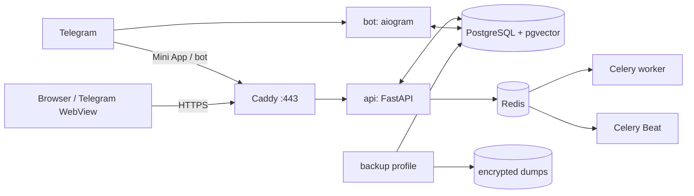

# Деплой и эксплуатация OracleAI

## Модель production-развёртывания

Production-like стек собирается Docker Compose из `postgres`, `redis`, `migrate`, `api`, `bot`, `worker`, `beat` и `caddy`. Один общий application image содержит API, Telegram-бота, LLM-agent runtime, астрологический движок, ONNX/MediaPipe palm engines, Mini App, admin и landing. `worker` и `beat` используют тот же image и подключаются к Redis/PostgreSQL.[1]



## Предварительные условия

| Требование | Почему это важно |
|---|---|
| Linux-хост с Docker Engine и Docker Compose v2 | Официальный способ запуска production-стека. |
| Домен с A/AAAA-записью на сервер | Нужен Caddy для автоматического TLS и Telegram Mini App. |
| Открытые TCP-порты 80 и 443 | Нужны HTTP→HTTPS и выдача сертификата. |
| Защищённый доступ к серверу | PostgreSQL, Redis, токены бота и платёжные секреты являются критичными данными. |
| Созданный Telegram-бот | Требуются `BOT_TOKEN`, `BOT_USERNAME`, `WEBAPP_URL`. |
| Резервное хранилище вне сервера | Локальный volume не защищает от потери хоста. |

Не публикуйте FastAPI напрямую на произвольном порту и не задавайте `DEV_MODE=1` в production.

## Конфигурация

Создайте файл `.env` из production-шаблона; он не должен попадать в Git.

```bash
cp .env.production.example .env
chmod 600 .env
```

| Группа | Переменные | Требование production |
|---|---|---|
| Режим и URL | `APP_ENV`, `DEV_MODE`, `WEBAPP_URL` | В production `DEV_MODE=0`; `WEBAPP_URL` — публичный HTTPS URL без credentials. При отсутствии `BOT_TOKEN`, `ADMIN_ID` или `WEBAPP_URL` API не стартует. |
| Telegram | `BOT_TOKEN`, `ADMIN_ID` | Реальные значения; не логировать и не передавать на клиент. |
| LLM | `LLM_PROVIDER`, `OPENAI_API_KEY`, `ANTHROPIC_API_KEY`, `CUSTOM_*` | Достаточно ключа выбранного провайдера; offline fallback остаётся аварийным режимом. |
| Платежи | `PADDLE_API_KEY`, `PADDLE_API_URL`, `PADDLE_CHECKOUT_URL`, `PADDLE_PRICE_IDS`, `PADDLE_WEBHOOK_SECRET` | Нужны вместе при включении web checkout; `PADDLE_PRICE_IDS` связывает внутренние планы с `pri_...` на сервере. |
| Наблюдаемость | `SENTRY_DSN`, `LOG_LEVEL`, `RELEASE_ID`, `LOG_FILE` | JSONL logs идут в stdout; `LOG_FILE` опционален и должен быть writable. Sentry — опционально, но рекомендован для production. |
| Резервное копирование | `BACKUP_ENCRYPTION_KEY_HOST_PATH`, `BACKUP_REQUIRE_ENCRYPTION`, `BACKUP_KEEP` | Профиль `backup` требует отдельный host key, encrypted PostgreSQL dump, checksum, off-site copy и restore drill. |

Конфигурация читается dataclass-настройками в `app/config.py`; неизвестные или небезопасные значения не следует «исправлять» прямо в контейнере.[2]

## Первый релиз

1. На сервере получите репозиторий из проверенного remote и перейдите на нужный commit/тег.
2. Заполните `.env`, настройте `infra/Caddyfile` на фактический домен и проверьте DNS.
3. Соберите и поднимите стек.
4. Проверьте health endpoint и основные пользовательские пути.
5. После успешной проверки настройте Telegram Mini App URL и webhook согласно выбранному режиму бота.

```bash
cd /srv/oracleAI
git fetch --all --tags
git checkout <approved-commit-or-tag>
docker compose -f infra/docker-compose.yml build --pull
docker compose -f infra/docker-compose.yml up -d
docker compose -f infra/docker-compose.yml ps
curl --fail --silent --show-error https://YOUR_DOMAIN/api/health
```

Минимальный smoke test включает: успешный `migrate`, `GET /api/health` с ответом `{"ok":true}`, `celery inspect ping`, открытие русского и английского лендинга, запуск Mini App из Telegram, подтверждение 16+ тестовой учётной записью, смену языка, выключение/включение памяти и один ответ проводника. Для web checkout сначала создайте Paddle transaction через серверный API и проверьте sandbox webhook только по `transaction.completed`; не подставляйте `tg_id` или тариф вручную в hosted URL.

## Обновление версии

> Перед обновлением обязательна подтверждённая резервная копия PostgreSQL. Dump создаётся профилем `backup`; не копируйте файлы тома PostgreSQL или SQLite во время записи.

```bash
cd /srv/oracleAI
docker compose --profile backup -f infra/docker-compose.yml up -d backup
git fetch --all --tags
git checkout <approved-commit-or-tag>
docker compose -f infra/docker-compose.yml build
docker compose -f infra/docker-compose.yml up -d
docker compose -f infra/docker-compose.yml exec api python -m scripts.selfcheck
# После подтверждения ключей провайдера повторить с внешним smoke-test:
# docker compose -f infra/docker-compose.yml exec -e SELF_CHECK_LIVE=1 api python -m scripts.selfcheck
docker compose -f infra/docker-compose.yml logs --tail=100 api bot
curl --fail --silent --show-error https://YOUR_DOMAIN/api/health
```

После изменения фронтенда проверьте версии cache-busting в `miniapp/index.html` и `miniapp/styles.css`; Telegram WebView может держать старые ассеты дольше обычного браузера.[3]

## Миграции и хранилище

В Docker Compose production-like режим использует PostgreSQL + pgvector. Сервис `migrate` выполняет `alembic upgrade head` и должен завершиться успешно до запуска API, бота, worker и Beat. Runtime также выполняет идемпотентный bootstrap для свежей базы. Не выполняйте ручные `ALTER TABLE` в production без кода миграции и резервной копии.[4]

SQLite/WAL остаётся поддерживаемым fallback для ручного dev/test-запуска, когда `DATABASE_URL` пуст. В этом режиме API и бот используют общий `DATA_DIR` и применяют SQLite-миграции при открытии соединения.

| Операция | Допустимый подход | Недопустимый подход |
|---|---|---|
| Новая таблица | Добавить DDL в schema, тестировать чистую БД. | Создать таблицу вручную только на production-сервере. |
| Новая колонка | Добавить reconcile-миграцию и совместимый fallback. | Полагаться на `CREATE TABLE IF NOT EXISTS`. |
| Изменение данных | Идемпотентный скрипт + backup + проверка количества строк. | Массовый UPDATE из shell без rollback-плана. |
| Откат кода | Вернуть образ/commit, совместимый с текущей схемой. | Откатить БД «на глаз» без протестированной процедуры. |

## Резервное копирование и восстановление

Профиль `backup` создаёт проверяемый custom-format `pg_dump`, шифрует его AES-256-CBC через host key, сохраняет SHA-256 checksum и применяет retention. Включите его только после создания `/etc/oracle/backup.key`; результат следует дополнительно копировать во внешнее зашифрованное хранилище.

```bash
install -d -m 700 /etc/oracle
openssl rand -base64 48 > /etc/oracle/backup.key
chmod 600 /etc/oracle/backup.key
docker compose --profile backup -f infra/docker-compose.yml up -d backup
```

| Контроль | Минимум |
|---|---|
| Частота | Не реже одного раза в сутки; до релиза — отдельная backup. |
| Хранение | Несколько точек восстановления вне единственного production-хоста. |
| Защита | Шифрование внешнего хранилища, ограниченный доступ, audit доступа. |
| Проверка | Периодически восстановить в изолированном контуре и выполнить `selfcheck`. |
| RPO/RTO | Зафиксировать владельцем продукта до публичного запуска. |

Процедура восстановления PostgreSQL: остановите writer-сервисы, сохраните текущий кластер как forensic-копию, проверьте checksum, расшифруйте dump во временный файл и восстановите его через helper. После проверки запустите миграцию и только затем поднимайте приложение.

```bash
BACKUP_ENCRYPTION_KEY_FILE=/etc/oracle/backup.key \
  ./infra/restore-postgres.sh /srv/oracle/backups/oracle-<дата>.dump.enc
make migrate
make up
make selfcheck
```

`restore-postgres.sh` проверяет checksum, расшифровывает dump во временный файл, останавливает writer-сервисы и передаёт custom-format dump в `pg_restore --clean --if-exists`. Для legacy/fallback SQLite остаётся отдельный `scripts/restore_db.sh`; он не предназначен для PostgreSQL-тома.

## Наблюдаемость и инциденты

| Сигнал | Источник | Первое действие |
|---|---|---|
| `/api/health` не `ok` | Health endpoint / Docker healthcheck | Проверить `api` logs, доступ к томам и свободное место. |
| Ошибки 5xx / latency | JSONL API logs, `X-Request-ID`, `X-Response-Time`, Sentry | Запустить `python -m scripts.ops_alerts --log-file <jsonl>` и сопоставить с release/provider/БД. |
| LLM fallback rate | JSONL `llm_request`/`llm_fallback` + `llm_usage` | Проверить provider health, queue, prompt/model release и offline safety; не удалять данные. |
| Не проходят платежи | JSONL `webhook_failure`, webhook logs, provider dashboard | Проверить подпись и sandbox/production-окружение; не повторять начисление вручную без idempotency. |
| Подозрение на утечку | Audit/logs, обращение support | Ограничить доступ, сохранить логи, следовать SECURITY. |

## Откат

Откат возможен только к commit, совместимому с текущей схемой. Сначала возвращайте приложение, затем убеждайтесь, что `/api/health` зелёный и пользовательские операции работают. Если изменение было разрушительным для данных, применяйте заранее проверенный restore из backup вместо произвольного ручного изменения базы.

## Мониторинг и логирование всех контейнеров

Compose включает observability-контур по умолчанию: `Loki` хранит JSON-логи Docker, `Alloy` читает логи всех контейнеров через read-only Docker socket и отправляет их в Loki, `cAdvisor` собирает CPU/RAM/network metrics контейнеров, `node-exporter` — метрики VPS, `Prometheus` хранит time series и alert rules, а `Grafana` автоматически получает оба datasource и готовый dashboard. Promtail намеренно не используется: Grafana объявила его EOL с 2 марта 2026 года и перенесла дальнейшее развитие в Alloy.[5]

```bash
# первый запуск
cp .env.production.example .env
chmod 600 .env
# обязательно заменить GRAFANA_ADMIN_PASSWORD и остальные CHANGE_ME значения
docker compose -f infra/docker-compose.yml up -d --build

docker compose -f infra/docker-compose.yml ps
```

Grafana по умолчанию слушает только `127.0.0.1:3000`, а Prometheus/Loki вообще не публикуются наружу. Для безопасного доступа с рабочей станции используйте SSH-туннель:

```bash
ssh -N -L 3000:127.0.0.1:3000 user@YOUR_VPS
# открыть http://127.0.0.1:3000
```

В Grafana откройте dashboard `OracleAI / OracleAI - Containers & Logs`. Для поиска логов используйте LogQL `{stack="oracleai"}` или фильтр `compose_service="api"`. Для Prometheus доступны alert rules по недоступности targets, частым рестартам, памяти контейнеров и свободному месту root filesystem. Локальные Docker `json-file` logs также ограничены `10m × 5` на контейнер; это защита от заполнения диска, а Loki хранит данные по умолчанию 7 дней.

Docker socket даёт Alloy и cAdvisor доступ к metadata и runtime statistics Docker-хоста, поэтому эти сервисы должны оставаться во внутренней сети и не получать публичные ports. На production VPS регулярно проверяйте размер volumes `loki_data`, `prometheus_data`, `grafana_data` и свободное место диска.

## Автоматический деплой через GitHub Actions

Workflow `.github/workflows/deploy.yml` запускается после push в `master` или вручную через `workflow_dispatch`. Он сначала проверяет Compose definition, затем подключается к VPS по SSH, получает точный `github.sha`, переключает checkout на этот commit, выполняет `docker compose pull` и `docker compose up -d --build --remove-orphans`, ждёт `/api/health` и печатает состояние сервисов. При ошибке workflow пытается вернуть предыдущий commit и поднять его обратно. Деплои сериализованы через GitHub concurrency, поэтому два rollout не выполняются одновременно.[6]

На VPS один раз подготовьте каталог и production env:

```bash
sudo install -d -o deploy -g deploy -m 755 /opt/oracleAI
cd /opt/oracleAI
git clone https://github.com/astartv1ai-del/oracleAI.git .
cp .env.production.example .env
chmod 600 .env
# заполнить .env реальными credentials и доменом
sudo install -d -m 700 /etc/oracle
openssl rand -base64 48 | sudo tee /etc/oracle/backup.key >/dev/null
sudo chmod 600 /etc/oracle/backup.key
docker compose -f infra/docker-compose.yml config
docker compose -f infra/docker-compose.yml up -d --build
```

Создайте в GitHub Settings → Secrets and variables → Actions следующие secrets. `VPS_KNOWN_HOSTS` должен содержать заранее проверенный результат `ssh-keyscan -H YOUR_VPS`; workflow не принимает host key автоматически, чтобы не скрывать MITM-риск.[6]

| Secret/variable | Значение |
|---|---|
| `VPS_HOST` | DNS-имя или IP VPS |
| `VPS_USER` | Непривилегированный deploy user, например `deploy` |
| `VPS_SSH_KEY` | Отдельный private deploy key без passphrase в runner; public key добавляется в `~deploy/.ssh/authorized_keys` |
| `VPS_KNOWN_HOSTS` | Проверенный host key из `ssh-keyscan -H` |
| Repository variable `VPS_APP_DIR` | Обычно `/opt/oracleAI` |
| Repository variable `VPS_SSH_PORT` | Обычно `22` |

Workflow не передаёт production `.env` через GitHub Actions и не хранит credentials в GitHub repository. `.env` создаётся и поддерживается только на VPS. Для SSH-ключа используйте отдельного пользователя без общего root login; дайте ему только необходимые права Docker, каталог проекта и backup path. GitHub рекомендует хранить sensitive values в secrets и не передавать их в командной строке без необходимости.[6]

После добавления secrets выполните сначала ручной `workflow_dispatch`, проверьте dashboard и `/api/health`, затем используйте push в `master` как production trigger. Не удаляйте старые Docker images до успешного health-check: встроенный rollback опирается на предыдущий checkout и доступные локальные build layers.

## References

[1]: [infra/docker-compose.yml](../infra/docker-compose.yml), [infra/Caddyfile](../infra/Caddyfile) и [infra/backup-postgres.sh](../infra/backup-postgres.sh) — состав runtime-стека, TLS и backup.
[2]: [app/config.py](../app/config.py), [.env.production.example](../.env.production.example) — типизированная конфигурация и production-шаблон.
[3]: [miniapp/index.html](../miniapp/index.html) и [miniapp/styles.css](../miniapp/styles.css) — подключение versioned клиентских ассетов.
[4]: [alembic/versions/0001_pg_baseline.py](../alembic/versions/0001_pg_baseline.py), [alembic/versions/0002_task_jobs.py](../alembic/versions/0002_task_jobs.py) и [app/data/migrations.py](../app/data/migrations.py) — порядок и правила миграций.
[5]: [Grafana Promtail EOL notice](https://grafana.com/docs/loki/latest/send-data/promtail/) и [Grafana Alloy Docker monitoring](https://grafana.com/docs/alloy/latest/monitor/monitor-docker-containers/) — актуальная схема сбора Docker logs/metrics.
[6]: [GitHub Actions secrets](https://docs.github.com/en/actions/security-for-github-actions/security-guides/using-secrets-in-github-actions) — правила хранения и использования deployment secrets.
