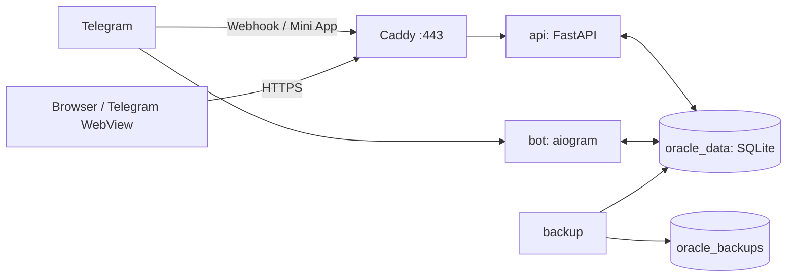

# Деплой и эксплуатация OracleAI

## Модель production-развёртывания

Production-стек собирается из четырёх сервисов Docker Compose: `bot`, `api`, `caddy` и `backup`. Два прикладных сервиса используют общий именованный том `oracle_data` для SQLite, Caddy завершает TLS на 80/443, а `backup` создаёт резервные копии базы в отдельном томе.[1]



## Предварительные условия

| Требование | Почему это важно |
|---|---|
| Linux-хост с Docker Engine и Docker Compose v2 | Официальный способ запуска production-стека. |
| Домен с A/AAAA-записью на сервер | Нужен Caddy для автоматического TLS и Telegram Mini App. |
| Открытые TCP-порты 80 и 443 | Нужны HTTP→HTTPS и выдача сертификата. |
| Защищённый доступ к серверу | SQLite, токены бота и платёжные секреты являются критичными данными. |
| Созданный Telegram-бот | Требуются `BOT_TOKEN`, `BOT_USERNAME`, `WEBAPP_URL`. |
| Резервное хранилище вне сервера | Локальный volume не защищает от потери хоста. |

Не публикуйте FastAPI напрямую на произвольном порту и не задавайте `DEV_MODE=1` в production.

## Конфигурация

Создайте файл `.env` из production-шаблона; он не должен попадать в Git.

```bash
cp .env.production.example .env
chmod 600 .env
```

| Группа | Переменные | Требование production |
|---|---|---|
| Режим и URL | `APP_ENV`, `DEV_MODE`, `WEBAPP_URL` | В production `DEV_MODE=0`; `WEBAPP_URL` — публичный HTTPS URL без credentials. При отсутствии `BOT_TOKEN`, `ADMIN_ID` или `WEBAPP_URL` API не стартует. |
| Telegram | `BOT_TOKEN`, `ADMIN_ID` | Реальные значения; не логировать и не передавать на клиент. |
| LLM | `LLM_PROVIDER`, `OPENAI_API_KEY`, `ANTHROPIC_API_KEY`, `CUSTOM_*` | Достаточно ключа выбранного провайдера; offline fallback остаётся аварийным режимом. |
| Платежи | `PADDLE_API_KEY`, `PADDLE_API_URL`, `PADDLE_CHECKOUT_URL`, `PADDLE_PRICE_IDS`, `PADDLE_WEBHOOK_SECRET` | Нужны вместе при включении web checkout; `PADDLE_PRICE_IDS` связывает внутренние планы с `pri_...` на сервере. |
| Наблюдаемость | `SENTRY_DSN`, `LOG_LEVEL`, `RELEASE_ID`, `LOG_FILE` | JSONL logs идут в stdout; `LOG_FILE` опционален и должен быть writable. Sentry — опционально, но рекомендован для production. |
| Резервное копирование | `BACKUP_ENCRYPTION_KEY_HOST_PATH`, `BACKUP_REQUIRE_ENCRYPTION`, `BACKUP_KEEP`, `BACKUP_S3_URL`, `BACKUP_S3_ACCESS_KEY`, `BACKUP_S3_SECRET_KEY`, `BACKUP_S3_BUCKET` | Production fail-closed требует отдельный host key, encrypted snapshot, checksum, off-site copy и restore drill. |

Конфигурация читается dataclass-настройками в `app/config.py`; неизвестные или небезопасные значения не следует «исправлять» прямо в контейнере.[2]

## Первый релиз

1. На сервере получите репозиторий из проверенного remote и перейдите на нужный commit/тег.
2. Заполните `.env`, настройте `infra/Caddyfile` на фактический домен и проверьте DNS.
3. Соберите и поднимите стек.
4. Проверьте health endpoint и основные пользовательские пути.
5. После успешной проверки настройте Telegram Mini App URL и webhook согласно выбранному режиму бота.

```bash
cd /srv/oracleAI
git fetch --all --tags
git checkout main
docker compose -f infra/docker-compose.yml build --pull
docker compose -f infra/docker-compose.yml up -d
docker compose -f infra/docker-compose.yml ps
curl --fail --silent --show-error https://YOUR_DOMAIN/api/health
```

Минимальный smoke test включает: `GET /api/health` с ответом `{"ok":true}`, открытие русского и английского лендинга, запуск Mini App из Telegram, подтверждение 16+ тестовой учётной записью, смену языка, выключение/включение памяти и один ответ проводника. Для web checkout сначала создайте Paddle transaction через серверный API и проверьте sandbox webhook только по `transaction.completed`; не подставляйте `tg_id` или тариф вручную в hosted URL.

## Обновление версии

> Перед обновлением обязательна подтверждённая резервная копия БД. SQLite нельзя считать «просто файлом», который безопасно копируется во время произвольной записи.

```bash
cd /srv/oracleAI
./scripts/backup_db.sh
git fetch --all --tags
git checkout <approved-commit-or-tag>
docker compose -f infra/docker-compose.yml build
docker compose -f infra/docker-compose.yml up -d
docker compose -f infra/docker-compose.yml exec api python -m scripts.selfcheck
# После подтверждения ключей провайдера повторить с внешним smoke-test:
# docker compose -f infra/docker-compose.yml exec -e SELF_CHECK_LIVE=1 api python -m scripts.selfcheck
docker compose -f infra/docker-compose.yml logs --tail=100 api bot
curl --fail --silent --show-error https://YOUR_DOMAIN/api/health
```

После изменения фронтенда проверьте версии cache-busting в `miniapp/index.html` и `miniapp/styles.css`; Telegram WebView может держать старые ассеты дольше обычного браузера.[3]

## Миграции и SQLite

Миграции запускаются приложением при открытии сессии в последовательности **таблицы → новые колонки → индексы**. Не выполняйте ручные `ALTER TABLE` в production без кода миграции и резервной копии: порядок создан именно для безопасной работы со старыми базами.[4]

| Операция | Допустимый подход | Недопустимый подход |
|---|---|---|
| Новая таблица | Добавить DDL в schema, тестировать чистую БД. | Создать таблицу вручную только на production-сервере. |
| Новая колонка | Добавить reconcile-миграцию и совместимый fallback. | Полагаться на `CREATE TABLE IF NOT EXISTS`. |
| Изменение данных | Идемпотентный скрипт + backup + проверка количества строк. | Массовый UPDATE из shell без rollback-плана. |
| Откат кода | Вернуть образ/commit, совместимый с текущей схемой. | Откатить БД «на глаз» без протестированной процедуры. |

## Резервное копирование и восстановление

Сервис `backup` и `scripts/backup_db.sh` предназначены для подготовки SQLite-backup. Настройте независимое копирование результата из `oracle_backups` в зашифрованное внешнее хранилище, retention-политику и регулярную проверку восстановления.[1]

| Контроль | Минимум |
|---|---|
| Частота | Не реже одного раза в сутки; до релиза — отдельная backup. |
| Хранение | Несколько точек восстановления вне единственного production-хоста. |
| Защита | Шифрование внешнего хранилища, ограниченный доступ, audit доступа. |
| Проверка | Периодически восстановить в изолированном контуре и выполнить `selfcheck`. |
| RPO/RTO | Зафиксировать владельцем продукта до публичного запуска. |

Процедура восстановления: остановите writer-сервисы, сохраните текущую повреждённую БД как forensic-копию, затем используйте проверяемый helper:

```bash
BACKUP_ENCRYPTION_KEY_FILE=/etc/oracle/backup.key \
  ./scripts/restore_db.sh /srv/oracle/backups/oracle-<дата>.db.enc \
  /srv/oracle/data/oracle.db
```

`restore_db.sh` проверяет checksum, расшифровывает во временный файл, выполняет
`PRAGMA integrity_check`, сохраняет rollback-копию текущей базы и только затем
заменяет destination. После восстановления поднимите API и бот, выполните
healthcheck/selfcheck и вручную проверьте тестовую учётную запись. Зафиксируйте
инцидент и время последней подтверждённой записи.

## Наблюдаемость и инциденты

| Сигнал | Источник | Первое действие |
|---|---|---|
| `/api/health` не `ok` | Health endpoint / Docker healthcheck | Проверить `api` logs, доступ к томам и свободное место. |
| Ошибки 5xx / latency | JSONL API logs, `X-Request-ID`, `X-Response-Time`, Sentry | Запустить `python -m scripts.ops_alerts --log-file <jsonl>` и сопоставить с release/provider/БД. |
| LLM fallback rate | JSONL `llm_request`/`llm_fallback` + `llm_usage` | Проверить provider health, queue, prompt/model release и offline safety; не удалять данные. |
| Не проходят платежи | JSONL `webhook_failure`, webhook logs, provider dashboard | Проверить подпись и sandbox/production-окружение; не повторять начисление вручную без idempotency. |
| Подозрение на утечку | Audit/logs, обращение support | Ограничить доступ, сохранить логи, следовать SECURITY. |

## Откат

Откат возможен только к commit, совместимому с текущей схемой. Сначала возвращайте приложение, затем убеждайтесь, что `/api/health` зелёный и пользовательские операции работают. Если изменение было разрушительным для данных, применяйте заранее проверенный restore из backup вместо произвольного ручного изменения базы.

## References

[1]: [infra/docker-compose.yml](../infra/docker-compose.yml), [infra/Caddyfile](../infra/Caddyfile) и [scripts/backup_db.sh](../scripts/backup_db.sh) — состав runtime-стека, TLS и backup.
[2]: [app/config.py](../app/config.py), [.env.production.example](../.env.production.example) — типизированная конфигурация и production-шаблон.
[3]: [miniapp/index.html](../miniapp/index.html) и [miniapp/styles.css](../miniapp/styles.css) — подключение versioned клиентских ассетов.
[4]: [app/data/schema.py](../app/data/schema.py) и [app/data/migrations.py](../app/data/migrations.py) — порядок и правила миграций.
