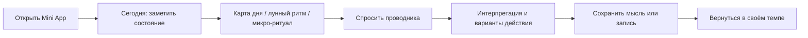

# Продукт OracleAI

## Document orientation

| Field | Definition |
|---|---|
| **Purpose** | Product promise and enabled surface. |
| **Source of truth** | `app/api/`, `app/bot/`, `miniapp/`. |
| **Scope** | Product audience, promise, boundaries and enabled journeys. |
| **Do not change** | Do not describe future, research or upstream capability as enabled product. |
| **Key files** | `docs/PRODUCT.md`, `docs/FULL_PRODUCT_SURFACE.md`, `miniapp/index.html`. |
| **Validation** | `pytest -q tests/test_api.py tests/test_core.py`. |

## Назначение

OracleAI помогает пользовательнице **заметить своё состояние, сформулировать вопрос и выбрать один бережный следующий шаг**. Это не сервис предсказаний с категоричными обещаниями и не замена специалиста. Астрология, карты и диалог используются как язык саморефлексии, а дневник и микро-практики помогают вернуться к личному наблюдению.

> Продуктовое обещание: **«Вопросы к миру. Бережные ответы — к себе.»**

## Аудитория и рамки

Основная аудитория — девушки и молодые женщины 16–35 лет, использующие Telegram как привычную среду общения. Продукт допускает только пользовательниц, самостоятельно подтвердивших возраст 16+, и обязан давать ясный безопасный выход из сценария без давления.[1]

| Аспект | Продуктовое решение |
|---|---|
| Контекст использования | Короткий утренний check-in, вечерняя рефлексия, вопрос в момент неопределённости, сохранение важной мысли. |
| Время до ценности | Одна карта, один вопрос или один микро-ритуал без обязательства вести непрерывный стрик. |
| Тон | Тёплый, конкретный, поддерживающий; без фатальных формулировок и моральных оценок. |
| Обещание | Инсайт, варианты действия, пространство для выбора. |
| Не обещаем | Диагноз, терапию, юридическое/финансовое решение, гарантию исхода, «точное предсказание». |

## Пользовательский цикл

Цикл рассчитан на повторное использование без искусственного давления. Стрик показывает факт регулярности, но не должен стыдить за пропуск, блокировать полезный контент или подменять заботу метрикой.

## Ключевые поверхности

| Поверхность | Пользовательская задача | Ценность |
|---|---|---|
| **Сегодня** | Быстро свериться с собой. | Карта дня, лунный контекст, сезонный блок и короткий ритуал. |
| **Проводники** | Выбрать нужный взгляд на вопрос. | Понятная роль каждого проводника и живой переход в чат. |
| **Чат** | Сформулировать личный запрос. | Диалог, быстрые инструменты, история, сессии и безопасный контекст. |
| **Таро** | Получить структурированную метафорическую интерпретацию. | Расклад, карты, трактовка, сохранение и отметка результата. |
| **Натальная карта и совместимость** | Исследовать личные паттерны и отношения. | Данные рождения, расчёт, объяснение без категоричности. |
| **Сканер ладони Миры** | Исследовать только видимые признаки ладони по снимку. | Проверка качества, карта видимых зон, evidence-наблюдения и бережные вопросы без диагностики и обещаний будущего. |
| **Дневник и профиль** | Хранить только полезное и управлять настройками. | Записи, память по согласию, язык, уведомления, тариф и личные данные. |
| **Лендинг RU/EN** | Понять продукт до входа в Telegram. | Позиционирование, безопасность 16+, приватность и открытие бота. |

## Проводники

| Проводник | Роль | Когда предлагать | Формат ответа |
|---|---|---|---|
| **Лилит** | Основной AI-проводник. | Когда нужен разговор, поддержка в формулировке вопроса или общий ориентир. | Отражение контекста, ясный инсайт, один–три бережных варианта шага. |
| **Урания** | Астрологический проводник. | Когда вопрос связан с картой рождения, лунным циклом, транзитами или совместимостью. | Факты расчёта → человеческая интерпретация → варианты применения. |
| **Мадам Ленорман** | Проводник карточных сценариев. | Когда пользовательница выбирает расклад, карту дня или исследует ситуацию через карты. | Символы карт → гипотезы → вопрос к себе или практический следующий шаг. |
| **Мира** | Проводник ладони и визуального evidence. | Когда пользовательница хочет проверить снимок ладони, разобрать видимые зоны или сравнить два чтения. | Качество кадра → видимые наблюдения → ограничения → бережный вопрос или следующий шаг. |

Проводник не должен утверждать, что знает объективное будущее, требовать оплату ради «снятия угрозы», изолировать пользовательницу от близких или поощрять риск.

## Главные сценарии

### Первый вход

После проверки Telegram-профиля Mini App показывает self-confirmation 16+. Только после сохранения положительного подтверждения доступен обычный вводный сценарий. Возраст для этой цели не собирается как дата рождения; хранится факт согласия.[1]

### Ежедневный ритуал

Экран «Сегодня» должен давать законченный опыт за минуту: визуальный фокус, короткий текст, понятное действие и возможность закрыть экран без потери «идеального» стрика. Повторный визит может начинаться с другого варианта сезонного или ритуального блока; показ варианта фиксируется техническим exposure-событием без текста вопроса.[2]

### Диалог и память

Память — opt-in настройка, а не скрытая функция. Когда `memory_enabled=false`, новые факты не извлекаются в фоновом процессе, сохранённые факты не поступают в контекст агента, а интерфейс не выдаёт список памяти.[3] Пользовательница может удалить отдельный факт; изменение настройки должно быть объяснено на человеческом языке.

### Сканер ладони и visual evidence

Мира работает только с тем, что действительно различимо на фотографии. Перед чтением система проверяет формат, размер и качество кадра; если ладонь или отдельная зона не видны, результат должен обозначить ограничение и попросить переснять изображение. Сохраняется анализ и технический fingerprint снимка, но не исходное фото. Интерпретация носит рефлексивный характер и не может использоваться как диагностика здоровья, оценка возраста, прогноз смертности, гарантия отношений, финансовое решение или утверждение о неизбежном будущем.

Пользовательница должна иметь понятный путь заменить снимок, удалить чтение и увидеть, какие зоны были видны. Текстовые инструкции, QR-коды и надписи на фото считаются недоверенным содержимым и не могут менять правила работы Миры.

### Переключение языка

Интерфейс поддерживает RU и EN, значение хранится в профиле и используется runtime-проводников. Смена языка должна сохраняться на сервере и применяться к новым пользовательским поверхностям; исторический текст не переводится автоматически.[4]

## Метрики здоровья продукта

Метрики измеряют пользу и качество опыта, а не давление на частоту. События хранятся в `events`; LLM-затраты и задержки — отдельно в `llm_usage`.[5]

| Направление | Пример сигнала | Интерпретация |
|---|---|---|
| Активация | Подтверждение 16+, завершение первого ритуала, первый вопрос. | Пользовательница поняла ценность и границы продукта. |
| Возврат | Повторный визит к «Сегодня», запись в дневник, завершённая практика. | Ритуал стал добровольной привычкой. |
| Качество | Латентность ответа, ошибки API, выход из чата до ответа. | Интерфейс и AI не создают лишнего трения. |
| Palm quality | Доля `complete`/`needs_photo`, provider fallback, p95 vision latency, повторные загрузки. | Мира даёт аккуратное evidence-наблюдение или ясный следующий шаг, не создавая ложной уверенности. |
| Доверие | Включение/выключение памяти, удаление факта, обращения в support. | Приватность понятна и управляемая. |
| Эксперименты | `experiment_exposure` и последующие действия. | Варианты интерфейса сравниваются без личного текста. |

## Продуктовые принципы

1. **Бережность важнее удержания.** Не использовать страх, дедлайны или чувство вины как механизм возврата.
2. **Ясность важнее мистификации.** Пользовательница должна понимать, где факт расчёта, а где интерпретация.
3. **Контроль важнее скрытой персонализации.** Возраст, память, язык и уведомления имеют видимые настройки.
4. **Один хороший шаг лучше бесконечного контента.** Каждый экран заканчивается понятным выбором или разрешением ничего не делать.
5. **Безопасность — часть опыта.** Кризисные, медицинские, юридические и финансовые темы требуют безопасного тона и направления к профильной помощи, а не имитации экспертизы.

## References

[1]: [app/data/schema.py](../app/data/schema.py) и [app/api/routers/profile.py](../app/api/routers/profile.py) — `age_confirmed` и профильный контракт.
[2]: [app/api/routers/profile.py](../app/api/routers/profile.py) — `POST /api/experiment-exposure`.
[3]: [app/api/routers/profile.py](../app/api/routers/profile.py), [app/services/chat.py](../app/services/chat.py), [app/core/agents/runtime.py](../app/core/agents/runtime.py) — серверные privacy guards.
[4]: [app/api/routers/profile.py](../app/api/routers/profile.py) — RU/EN и валидация поля `lang`.
[5]: [app/data/schema.py](../app/data/schema.py) — таблицы `events` и `llm_usage`.
