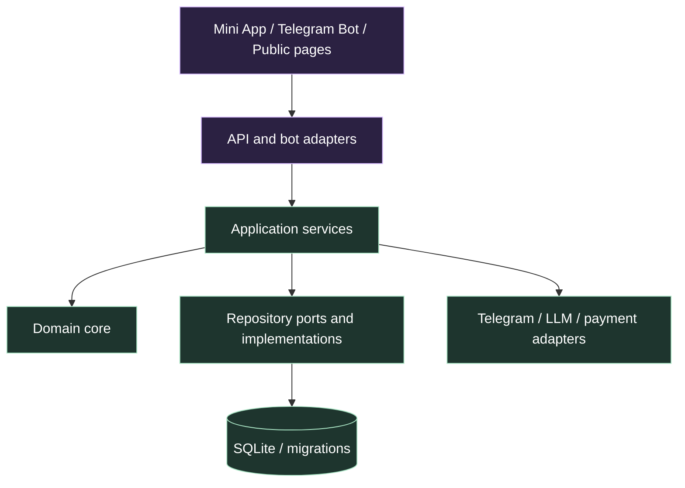

# Архитектурный рефакторинг OracleAI

**Статус:** принят и внедряется
**Дата:** 12 августа 2026
**Область:** Telegram Mini App, FastAPI API, Telegram Bot, SQLite и LLM-интеграции

## Решение

OracleAI развивается как **модульный монолит**. Это означает один развёртываемый продукт и одна согласованная база данных, но с явными границами между транспортным кодом, прикладными сценариями, доменной логикой и инфраструктурой. Такой подход оставляет разработку и локальный запуск простыми, исключает преждевременное усложнение микросервисами и при этом даёт команде ясные точки для будущего выделения самостоятельных модулей.

> Clean Architecture в OracleAI — это не массовое переименование директорий. Это правило направления зависимостей: пользовательские интерфейсы обращаются к прикладным сценариям, сценарии используют доменную логику и порты данных, а детали FastAPI, Telegram, SQLite и внешних LLM не проникают в правила продукта.

## Выявленная отправная точка

Архитектурная инвентаризация показала, что продукт уже имеет полезные естественные слои: `api`, `bot`, `services`, `core`, `repo` и `data`. Основная сложность возникала не из-за числа файлов, а из-за нескольких неявных границ: API-роутеры импортировали приватные помощники друг друга, часть крупных сценариев жила одновременно в роутере и нескольких сервисах, а Mini App опиралась на единый глобальный объект без формально описанного контракта.

| Наблюдение | Риск без рефакторинга | Принятое решение |
|---|---|---|
| Роутеры `chart`, `tarot` и `share` использовали приватные функции соседних роутеров | Изменение одного HTTP-файла может сломать несвязанный пользовательский сценарий | Перенести общие HTTP-адаптеры в `app.api.common`; запретить импорты между роутерами |
| Сценарий совместимости объединял HTTP-разбор, лимиты, память, аналитику, диалоги и вычисления | Трудно тестировать и повторно использовать из бота | Вынести прикладной workflow в `app.services.compatibility` |
| Pydantic-модели росли внутри роутеров | Контракт запроса и обработчик меняются как одна неделимая единица | Размещать новые и перенесённые входные модели в `app.api.contracts` |
| `app.core` содержит как чистые алгоритмы, так и legacy-адаптеры к данным/LLM | Легко добавить новую зависимость «в обратную сторону» | Считать `core` доменным ядром; новые сценарии данных строить в `services`, legacy перемещать постепенно |
| Mini App загружается как последовательность классических скриптов и использует `window.app` | Неочевиден порядок и жизненный цикл состояния | Ввести формальный runtime/manifest и единое начальное состояние с совместимым фасадом `window.app` |

## Целевая карта слоёв



| Слой | Каталоги | Разрешённая ответственность | Не должен делать |
|---|---|---|---|
| **Интерфейс и транспорт** | `miniapp/`, `app/api/routers/`, `app/bot/`, `web/` | Разобрать запрос, авторизовать, вызвать сценарий, отобразить результат | Содержать SQL, бизнес-алгоритмы, прямые вызовы соседнего роутера |
| **API common и contracts** | `app/api/common/`, `app/api/contracts/` | Валидация HTTP-входа, единая сериализация ошибок, Pydantic request-модели | Знать детали экранов Mini App или выполнять workflow |
| **Прикладные сценарии** | `app/services/` | Оркестрировать use case: лимиты, доменную логику, репозитории, аналитику и внешние адаптеры | Зависеть от `FastAPI`, `Request`, `APIRouter` или DOM |
| **Доменное ядро** | `app/core/` | Вычисления астрологии/Таро, правила безопасности, модели агентов, чистые преобразования | Импортировать транспортные слои; новые модули не обращаются к HTTP |
| **Данные** | `app/repo/`, `app/data/` | SQL, транзакции, миграции, преобразование строк БД | Содержать продуктовые правила, HTTP-статусы или UI-тексты |
| **Интеграции** | `app/services/telegram.py`, `app/core/llm.py`, payment services | Адаптировать внешние API к прикладным сценариям | Управлять навигацией, HTTP-ответами или SQL других модулей |

## Правила зависимостей

Новые зависимости строятся только сверху вниз. Роутер может импортировать contract, common helper и service; service — core, repo и integration adapter; repository — data/session. Допустимы явные composition roots (`app.api.main`, `app.bot.main`), в которых собираются адаптеры. Не допускаются зависимости `core → api`, `repo → services`, `router → router` и импорт всего пакета `app.repo` ради одного модуля.

Для legacy-кода применяется правило «**улучшать при касании**»: функциональные переносы выполняются вместе с тестами и без изменения URL, JSON-полей, лимитов или кодов ошибок. Массовый перенос тысяч строк в одном коммите запрещён, потому что он снижает наблюдаемость регрессий.

## Backend: целевая структура

```text
app/
├── api/
│   ├── common/          # HTTP-ошибки, общая валидация, response helpers
│   ├── contracts/       # Pydantic request/response models по функции
│   ├── routers/         # тонкие endpoint-адаптеры
│   ├── deps.py          # auth, DB dependency, rate limits
│   └── main.py          # composition root FastAPI
├── services/            # application use cases по предметной области
│   ├── compatibility.py
│   ├── chat.py
│   ├── billing.py
│   └── ...
├── core/                # доменные правила и чистые вычисления
├── repo/                # SQLite repositories
├── data/                # schema, migrations, sessions, seed
└── bot/                 # Telegram adapter и FSM
```

Функциональные области OracleAI остаются независимыми по смыслу: **identity/profile**, **conversation and memory**, **astrology and compatibility**, **tarot and readings**, **daily ritual**, **billing and entitlements**, **growth and analytics**. Когда один endpoint использует несколько областей, он вызывает один application service; тот создаёт координацию, а не копирует логику из других роутеров.

## Frontend: целевая структура

Mini App остаётся без сборщика, чтобы сохранить минимальный production-рисок для Telegram WebView. Вместо неявного набора скриптов вводится контролируемый runtime, где один фасад поддерживает обратную совместимость.

```text
miniapp/js/
├── 00-runtime.js        # OracleRuntime state boundary and legacy facade binding
├── 01-utils.js          # pure formatting, i18n, safe DOM helpers
├── 02-api.js            # HTTP client only
├── 03-data.js           # static product data and icon registry
├── 05-app.js            # bootstrap and shell facade
├── 06-home.js – 12-misc.js # current feature modules during migration
├── 13-events.js         # one delegated DOM transport boundary
├── 14-gestures.js       # gesture adapter
└── 15-actions.js        # data-act command registry
```

На первом этапе сохранится `window.app` как публичный совместимый фасад. Новые feature-модули получают данные через `app.state`, а не создают дополнительные глобальные переменные. `window.OracleRuntime` — единственный новый runtime namespace; `window.app` остаётся документированным фасадом до завершения миграции. Порядок подключения закрепляется в `index.html` и проверяется архитектурным тестом.

## Выполняемый этап

Текущий рефакторинг намеренно ограничен безопасным, но полноценным вертикальным срезом.

| Шаг | Изменение | Пользовательский контракт |
|---|---|---|
| 1 | Добавить `app.api.common` для общей валидации дат и единого отображения access-denial | URL и тексты ошибок сохраняются |
| 2 | Добавить `app.api.contracts` и вынести request DTO сценария совместимости | JSON-вход и OpenAPI-схемы эквивалентны |
| 3 | Вынести compatibility workflow из `chart` router в `services.compatibility` | Те же ответы, лимиты, память, аналитика и сохранение партнёра |
| 4 | Убрать router-to-router imports | Нет зависимости HTTP-сценария от приватной функции другого роутера |
| 5 | Ввести `00-runtime.js`, `15-actions.js` и явный front-end lifecycle contract | `window.app` и текущие сценарии остаются рабочими |
| 6 | Добавить архитектурные тесты/самопроверки и документацию | Новая связность не возвращается незаметно |

## Критерии готовности

Рефакторинг считается завершённым, когда все существующие `pytest`-тесты проходят, синтаксис каждого JavaScript-файла проверен, runtime Mini App и публичные API smoke-проверены, а архитектурные guardrails отклоняют импорты между роутерами и недокументированный порядок frontend-скриптов. Изменения оформляются отдельным коммитом, чтобы их можно было легко проверить и при необходимости откатить.

## Последующие миграции

После этого этапа команда переносит крупные use cases только по мере работы с ними: генерацию отчётов, сборку натальной карты, daily ritual и admin workflows. Каждая миграция должна оставлять тонкий роутер, один application service, тест контракта и обновление этого документа. Переход на PostgreSQL, Redis или отдельные сервисы рассматривается только при измеримой потребности, а не как часть косметического рефакторинга.
